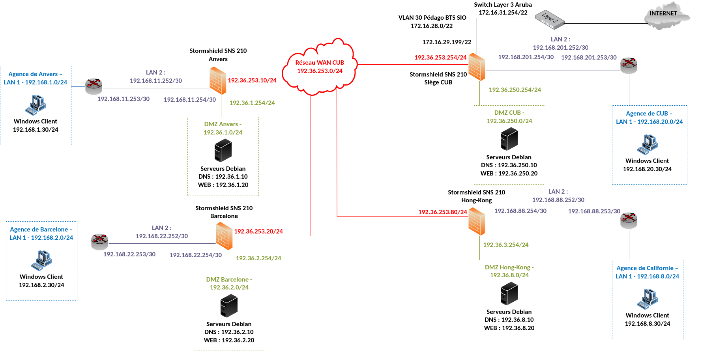
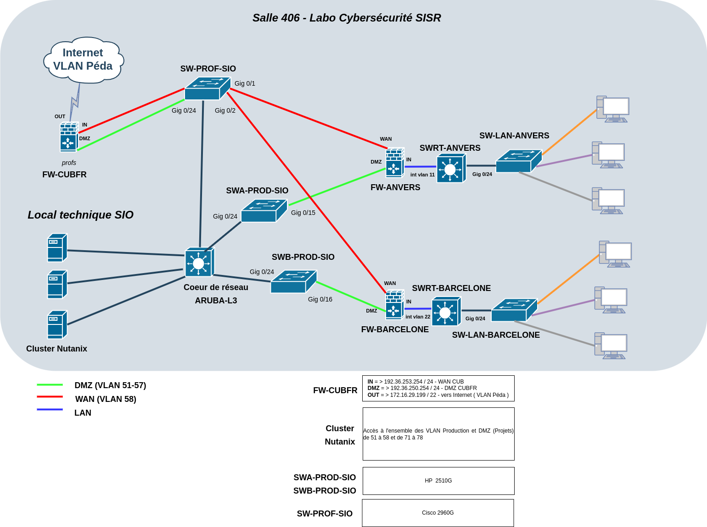

# Plan de l'infrastructure CUB

!!! abstract "Informations sur le document"
    - **Auteur :** KADA Amine
    - **Classe :** BTS SIO 2 - Option SISR
    - **Date :** 16/09/2026
    - **Sujet :** Plan de l'infrastructure CUB

---

## Schéma logique

Le schéma logique représente l'organisation logique du réseau : les adresses IP, les VLANs, les zones (LAN, DMZ, WAN) et les flux entre les équipements.

---

## Schéma physique

Le schéma physique représente l'implantation matérielle de l'infrastructure : les équipements réels (switchs, routeurs, pare-feux, serveurs) et leurs interconnexions câblées.

