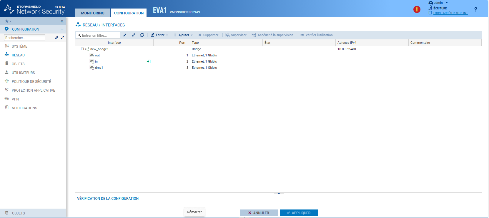
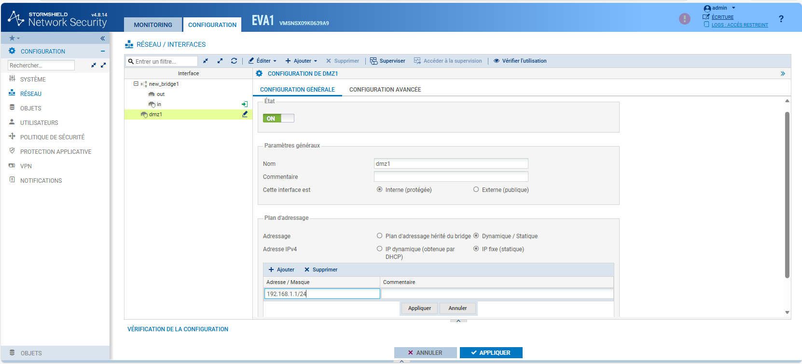

# Configuration d'une interface sur Stormshield avec la configuration IP


---

## Informations

- **Auteur :** Amine Kada
- **Date :** 12/09/2026
- **Domaine :** Réseau

---

## 1. Sommaire

- [1. Sommaire](#1-sommaire)
- [2. Contexte](#2-contexte)
- [3. Accès à la topologie des interfaces](#3-acces-a-la-topologie-des-interfaces)
- [4. Provisionnement de l'adresse IP statique](#4-provisionnement-de-ladresse-ip-statique)
- [5. Application et contrôle d'état](#5-application-et-controle-detat)

## 2. Contexte

Le provisionnement d'une interface réseau avec une adresse IP statique sur un pare-feu Stormshield Network Security (SNS) est un prérequis structurel de l'infrastructure. Cette procédure garantit un point de routage déterministe pour les segments internes (LAN, DMZ) et permet l'application stricte des politiques de sécurité (filtrage, NAT, IPsec). L'opération nécessite une définition exacte du bloc CIDR et une validation rigoureuse de la table de routage pour prévenir tout conflit d'adressage (IP overlap) au sein de l'architecture.

## 3. Accès à la topologie des interfaces {#3-acces-a-la-topologie-des-interfaces}

3.1. **Navigation vers le module d'interface**. Depuis la console d'administration Web de l'appliance, se rendre dans **CONFIGURATION** > **RÉSEAU** > **INTERFACES** pour visualiser la hiérarchie logique et physique (ponts, agrégats, VLANs).

> [!tip] Audit préalable
> Avant toute modification du plan d'adressage, vérifiez l'état de l'interface et son affectation au sein d'un éventuel pont (Bridge) pour garantir l'absence de chevauchement de sous-réseaux.



## 4. Provisionnement de l'adresse IP statique

4.1. **Édition des paramètres d'interface**. Sélectionner l'interface cible (par exemple `dmz1`) dans l'arborescence, activer son état administratif (`ON`) et la catégoriser selon son niveau de confiance.

4.2. **Configuration du plan d'adressage**. Définir le mode d'attribution IP de l'interface sur statique et renseigner le tuple IP/Masque.



- `État` : Placer le curseur sur `ON` pour monter l'interface (équivalent du *no shutdown*).
- `Cette interface est` : Sélectionner `Interne (protégée)` ou `Externe (publique)` selon la zone de sécurité visée.
- `Adressage` : Choisir `Dynamique / Statique`.
- `Adresse IPv4` : Sélectionner `IP fixe (statique)`.
- `Adresse / Masque` : Saisir la valeur de l'adresse IP suivie de la notation CIDR du sous-réseau (ex: `192.168.1.1/24`).

## 5. Application et contrôle d'état {#5-application-et-controle-detat}

5.1. **Validation de la configuration**. Cliquer sur "Appliquer" au niveau du panneau de l'interface, puis valider globalement la configuration du pare-feu avec le bouton "APPLIQUER" situé en bas de la page.

> [!warning] Interruption de service (Downtime)
> La modification d'une adresse IP ou d'un masque de sous-réseau sur une interface active entraîne une purge de la table ARP et la réévaluation du routage. Effectuez cette action exclusivement durant une fenêtre de maintenance autorisée (CAB).

5.2. **Contrôle post-déploiement en CLI (Optionnel)**. Afin de vérifier la bonne application au niveau de la couche système, connectez-vous en SSH et exécutez la commande suivante :

```bash
ifconfig dmz1
```

* `ifconfig [interface]` : Vérifie que l'adresse IP, le masque (netmask) et l'état UP/RUNNING sont correctement assignés au niveau du noyau de l'appliance.
