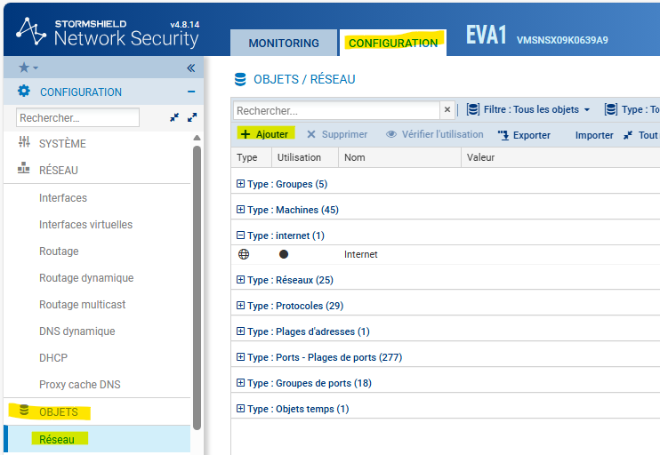
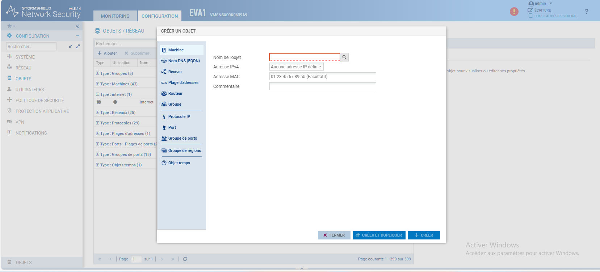
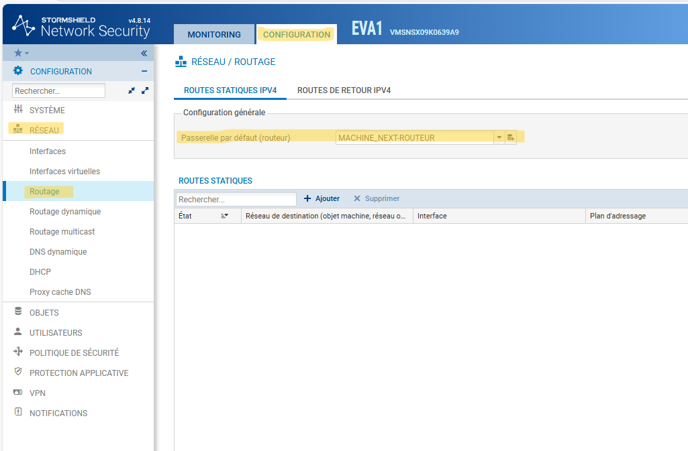
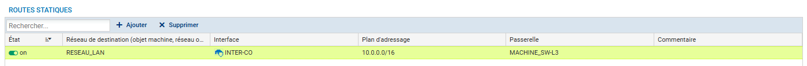

# Configuration du routage sur stormshield

---

## Informations

- **Auteur :** Amine Kada
- **Date :** 12/09/2026
- **Domaine :** Réseau

---

## 1. Sommaire

- [1. Sommaire](#1-sommaire)
- [2. Contexte](#2-contexte)
- [3. Création de l'objet Routeur](#3-creation-de-lobjet-routeur)
- [4. Configuration de la route par défaut](#4-configuration-de-la-route-par-defaut)
- [5. Configuration des routes statiques](#5-configuration-des-routes-statiques)

## 2. Contexte

Ce document décrit la procédure d'implémentation du routage sur le pare-feu Stormshield. L'objectif est d'assurer l'interconnexion des réseaux (LAN, DMZ, WAN) par la définition de la passerelle par défaut et l'ajout de routes statiques vers les routeurs de tronçon suivant.

## 3. Création de l'objet Routeur {#3-creation-de-lobjet-routeur}

> [!warning] Nommage des objets
> Il est indispensable de nommer ces objets avec le préfixe `MACHINE_<nom-routeur>` pour respecter les conventions de nommage sur le pare-feu.

3.1. **Déclaration des routeurs.** Création des objets réseaux de type "Machine" permettant de référencer les routeurs de destination. Allez dans **Configuration** > **Objets**.

**Capture d'écran pour l'accès à l'onglet de création de l'objet :**

**Capture d'écran de la création de l'objet :**

- `Nom de l'objet` : Utilisation de la convention de nommage pour donner un nom à l'objet (Ex. MACHINE_SW-L3).
- `Adresse IPv4` : Adresse IP de la machine sur le réseau.

## 4. Configuration de la route par défaut {#4-configuration-de-la-route-par-defaut}

4.1. **Assignation de la passerelle.** Définition du routeur par défaut vers lequel le trafic non spécifié sera orienté (Route S* `0.0.0.0/0`). Rendez-vous dans **Configuration** > **Réseau** > **Routage** > **Routes statiques IPv4**. Puis sélectionner l'objet de votre prochain routeur via le menu déroulant (Objet créé précédemment).

## 5. Configuration des routes statiques {#5-configuration-des-routes-statiques}

> [!warning] Types de routes
> Les réseaux directement connectés (Type C comme la DMZ, le WAN ou le réseau d'Inter-co) sont automatiquement injectés. Seuls les réseaux distants (Type S) nécessitent une configuration explicite.

5.1.  **Ajout des routes statiques.** Déclaration de la route de type S pour joindre le réseau LAN à travers l'interface d'interconnexion.

- `Réseau de destination` : Sélectionner l'objet correspondant au LAN (Ex. `RESEAU_LAN`).
- `Interface` : Sélectionner l'interface de sortie appropriée (Ex. `INTER-CO`).
- `Passerelle` : Sélectionner l'objet du routeur de prochain saut (Ex. `MACHINE_RTR_LAN` ou équivalent selon nommage).
