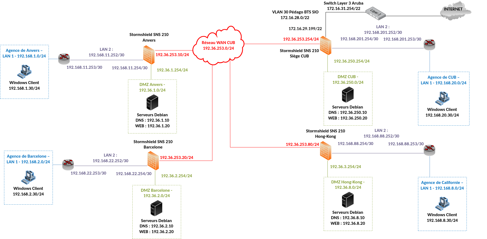
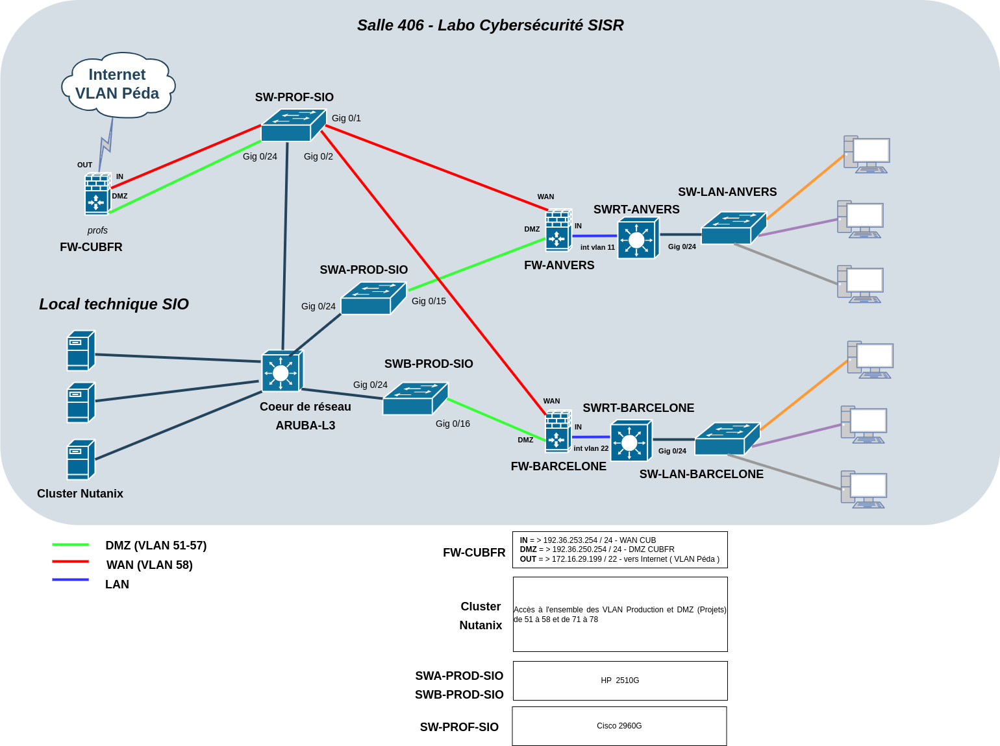

# GÉNÉRAL - Plan de l'infrastructure CUB

    
<strong>Auteur :</strong> KADA Amine

    
<strong>Classe :</strong> BTS SIO 2 - Option SISR

    
<strong>Date :</strong> 16/09/2026

    
<strong>Contexte :</strong> Configuration Plan de l'infrastructure CUB

---

## Schéma logique

Le schéma logique représente l'organisation logique du réseau : les adresses IP, les VLANs, les zones (LAN, DMZ, WAN) et les flux entre les équipements.

---

## Schéma physique

Le schéma physique représente l'implantation matérielle de l'infrastructure : les équipements réels (switchs, routeurs, pare-feux, serveurs) et leurs interconnexions câblées.

