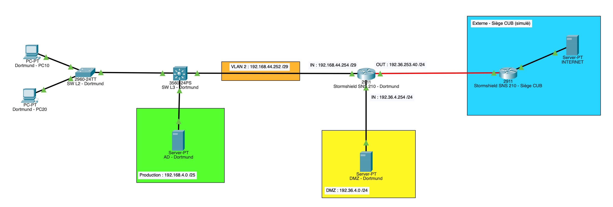
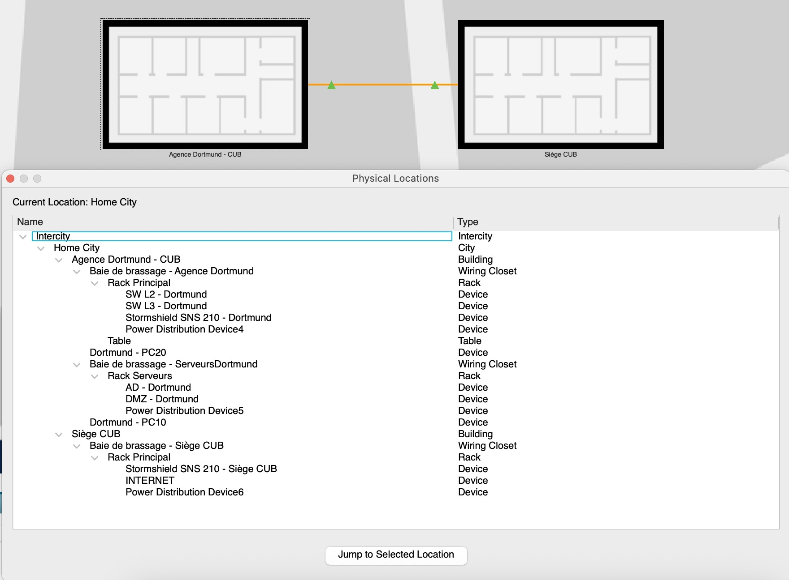

# BLOC 2 - Vlsm Routage

    
<strong>Auteur :</strong> KADA Amine

    
<strong>Classe :</strong> BTS SIO 2 - Option SISR

    
<strong>Date :</strong> 22/01/2026

    
<strong>Contexte :</strong> VLSM & Table de routage CUB - Situation 1

---

## Maquette de notre Agence à Dortmund - CUB 

1. Maquette logique

2. Maquette physique

---
## Table de routage CUB
### Table de routage coeur du réseau SW_L3_Dortmund

| **Name**                        | **Réseau de destination** | **Masque**            | **Passerelle IP (Next Hop)** | **Interface de sortie** | **Type** |
| ------------------------------- | ------------------------- | --------------------- | ---------------------------- | ----------------------- | -------- |
| **VLAN 54 - Production**        | 192.168.4.0               | 255.255.255.128 (/25) | -                            | 192.168.4.126           | **C**    |
| **VLAN 10 - Clients**           | 192.168.4.128             | 255.255.255.192 (/26) | -                            | 192.168.4.190           | **C**    |
| **VLAN 20 - Admin Sys.**        | 192.168.4.192             | 255.255.255.240 (/28) | -                            | 192.168.4.206           | **C**    |
| **VLAN 2 - Transit LAN**        | 192.168.44.248            | 255.255.255.248 (/29) | -                            | 192.168.44.253          | **C**    |
| **Route par défaut (Internet)** | 0.0.0.0                   | 0.0.0.0 (/0)          | 192.168.44.254               | 192.168.44.253          | **S**    |

### Table de routage Stormshield SNS 210 - Dortmund

| **Name**                        | **Réseau de destination** | **Masque**            | **Passerelle IP** | **Interface de sortie** | **Type** |
| ------------------------------- | ------------------------- | --------------------- | ----------------- | ----------------------- | -------- |
| **Réseau LAN**                  | 192.168.44.248            | 255.255.255.248 (/29) | -                 | 192.168.44.254          | **C**    |
| **DMZ Dortmund**                | 192.36.4.0                | 255.255.255.0 (/24)   | -                 | 192.36.4.254            | **C**    |
| **Réseau WAN**                  | 192.36.253.0              | 255.255.255.0 (/24)   | -                 | 192.36.253.40           | **C**    |
| **LANs Internes**               | 192.168.4.0               | 255.255.255.0 (/24)   | 192.168.44.253    | 192.168.44.254          | **S**    |
| **Route par défaut (Internet)** | 0.0.0.0                   | 0.0.0.0 (/0)          | 192.36.253.254    | 192.36.253.40           | **S**    |

---

## Table NAT CUB

| **Name** | **IP SRC Avant**   | **Port SRC Avant** | **IP DEST Avant** | **Port DEST Avant** |
| -------- | ------------------ | ------------------ | ----------------- | ------------------- |
| LAN      | 192.168.4.0 /24    | *                  | *                 | *                   |
| INTER CO | 192.168.44.248 /29 | *                  | *                 | *                   |

| **Name** | **IP SRC Après** | **Port SRC Après** | **IP DEST Après** | **Port DEST Après** |
| -------- | ---------------- | ------------------ | ----------------- | ------------------- |
| LAN      | 192.36.253.40    | *                  | *                 | *                   |
| INTER CO | 192.36.253.40    | *                  | *                 | *                   |
