# BLOC 2 - Gestion de versions avec Git & GitHub


<div style="margin-top: 70px; border: 1px solid #ccc; padding: 20px; border-radius: 10px;">
    <p><strong>Auteur :</strong> KADA Amine</p>
    <p><strong>Classe :</strong> BTS SIO 2 - Option SISR</p>
    <p><strong>Date :</strong> 30/09/2026</p>
    <p><strong>Contexte :</strong> Git & Github</p>
</div>

---

## Question 1 : Relever la version Git installé ?

```bash
git version 2.56.0 (Windows Server)
```

## Question 2 : Quel est le rôle d'un logiciel de gestion de version tel que Git ?

Il permet de suivre l'historique des modifications d'un projet, de revenir à une version précédente en cas d'erreur, et de faciliter le travail collaboratif sans écraser le travail des autres.

## Question 3 : Pourquoi Git associe-t-il un nom et une adresse électronique aux commits ?

Pour la traçabilité. Ça permet de savoir exactement "qui a fait quoi et quand", ce qui est indispensable quand on travaille en équipe.

## Question 4 : Que signifie l'initialisation d'un dépôt Git ?

Cela consiste à créer un dossier caché .git à la racine du projet (via la commande git init). À partir de là, Git commence à surveiller les fichiers de ce dossier.

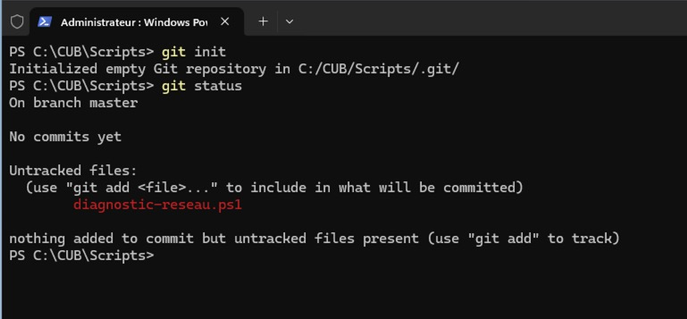

## Question 5 :  Quel est le rôle de la commande "git status" ?

Elle permet d'afficher l'état actuel du dépôt : on voit sur quelle branche on est, quels fichiers ont été modifiés, ajoutés, supprimés, et ce qui est prêt à être commité (indexé).

## Question 6 : Quelle différence observez-vous dans "git status" avant et après la commande "git add diagnostic-reseau.ps1" ?

Le fichier passe de l'état "non suivi" (en rouge) à l'état "indexé" (en vert), prêt à être enregistré dans le prochain commit.

Avant le git add :

```powershell
PS C:\Users\aminekada\Documents\cub-script\scripts> git status 
Sur la branche master

Fichiers non suivis:
  (utilisez "git add <fichier>..." pour inclure dans ce qui sera validé)
    diagnostic-reseau.ps1

aucune modification ajoutée à la validation mais des fichiers non suivis sont présents (utilisez "git add" pour les suivre)
```

Après le git add :
```powershell
PS C:\Users\aminekada\Documents\cub-script\scripts> git status 
Sur la branche master

Aucun commit

Modifications qui seront validées :
  (utilisez "git rm --cached <fichier>..." pour désindexer)
    nouveau fichier : diagnostic-reseau.ps1
```

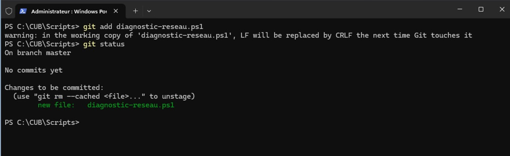

## Question 7 : Qu'est-ce qu'un commit ?

C'est une sauvegarde (un "instantané") de l'état du projet à un instant T. Il fige les modifications ajoutées dans l'index.

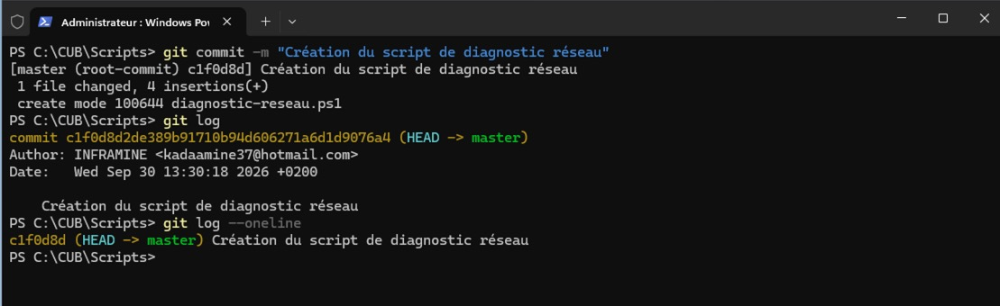

## Question 8 : Pourquoi faut-il utiliser un message de commit précis et explicite ?

Pour que moi-même plus tard, ou d'autres membres de l'équipe, puissions comprendre ce qui a été ajouté ou corrigé sans avoir besoin d'ouvrir et de relire tout le code source.

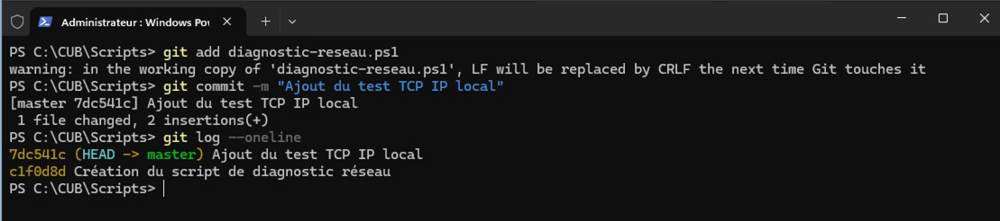

## Question 9 : Que permet d'afficher la commande "git diff" ?

Elle montre les différences ligne par ligne (ce qui a été ajouté en vert ou retiré en rouge) entre l'état actuel de nos fichiers et la dernière version sauvegardée.

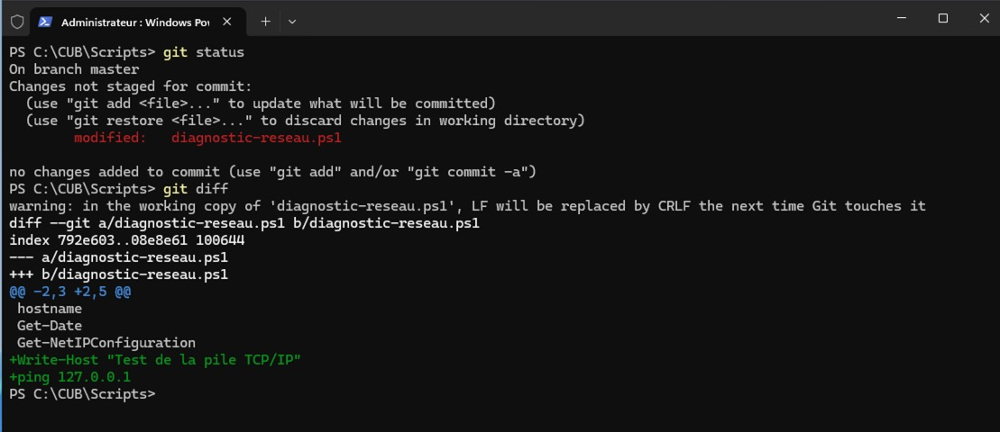

## Question 10 : Combien de versions du projet sont maintenant présentes dans l'historique ?

Il y a 2 versions (commits) présentes dans l'historique.

```powershell
PS C:\Users\aminekada\Documents\cub-script\scripts> git log --oneline
caff784 (HEAD -> master) Ajout du test TCP IP local
23ff690 Création du script de diagnostic réseau
```

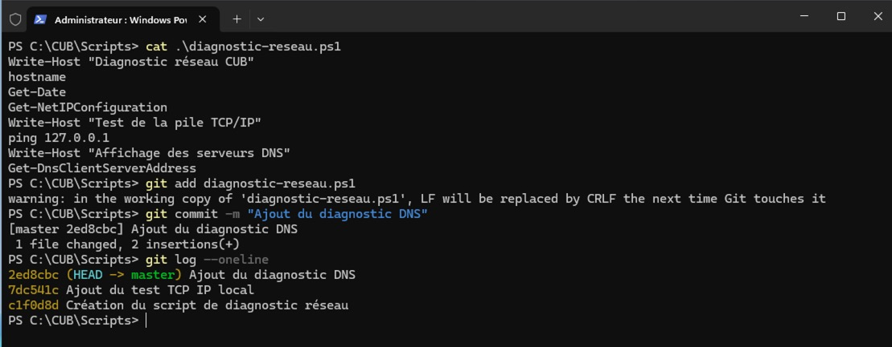

## Question 11 : Indiquer le rôle de chacune des commandes : git status, git diff, git add, git commit et git log.

1. git status : Voir l'état des fichiers (modifiés, indexés, etc.).

2. git diff : Voir le détail des modifications apportées dans le code.

3. git add : Ajouter des fichiers modifiés dans l'index (la zone de préparation).

4. git commit : Sauvegarder les fichiers indexés dans l'historique avec un message.

5. git log : Afficher l'historique de tous les commits.

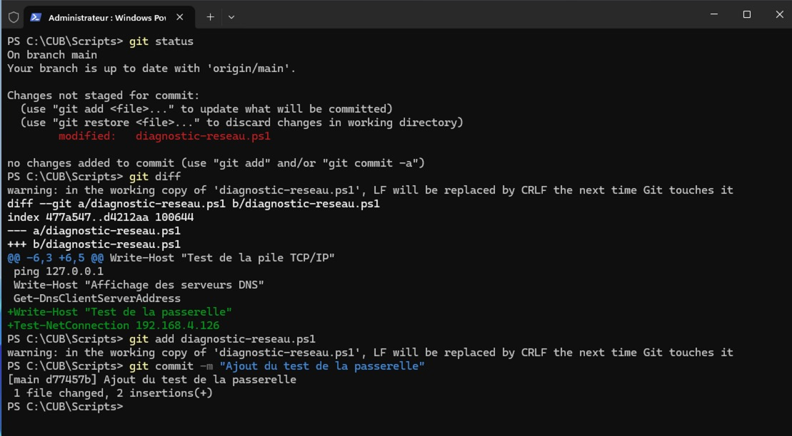

## Question 12 : Quel est l'intérêt de la commande "git restore" ?

Elle permet d'annuler les modifications non commitées d'un fichier dans notre répertoire de travail pour revenir à la dernière version sauvegardée.

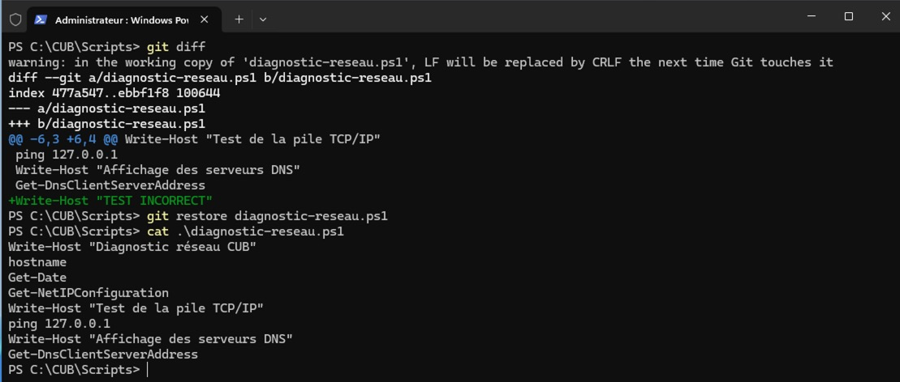

## Question 13 : La modification supprimée avait-elle déjà été enregistrée dans un commit ? Justifier.

Non. git restore n'agit que sur les modifications en cours (non commitées). Si la modification avait été enregistrée dans un commit, il aurait fallu utiliser git revert ou git reset pour revenir en arrière.

## Question 14 : Peut-on utiliser Git sans Github ? Justifier.

Oui, complètement. Git est un logiciel local. On peut très bien versionner ses scripts sur sa propre machine sans jamais les envoyer sur un serveur distant.

## Question 15 : Quelle différence faites-vous entre Git et Github ?

Git est l'outil en ligne de commande installé sur la machine qui gère les versions. GitHub est un service web qui héberge des dépôts Git distants pour faciliter la sauvegarde cloud et le travail en équipe.

## Question 16 : Quelle différence existe-t-il entre un dépôt public et privé ?

Un dépôt public est visible par tout le monde sur internet. Un dépôt privé est invisible au public et uniquement accessible par son propriétaire et les collaborateurs qu'il a invités.

## Question 17 : Pourquoi un administrateur système doit-il être vigilant avant de publier un script sur un dépôt public ?

Parce qu'il pourrait accidentellement publier des informations sensibles liées à l'infrastructure de son entreprise, ce qui créerait une énorme faille de sécurité.

## Question 18 : Donner trois exemples d'informations qui ne doivent pas être publiées dans un dépôt Github ?

1. Des mots de passe en clair (comptes de service, BDD...).
2. Des clés privées (SSH, certificats, jetons d'API).
3. Des adresses IP internes privées de serveurs critiques.

## Question 19 : Que représente le nom "origin" ?

C'est le nom par défaut ("l'alias") que Git donne au dépôt distant principal (souvent hébergé sur GitHub) auquel notre dépôt local est relié.

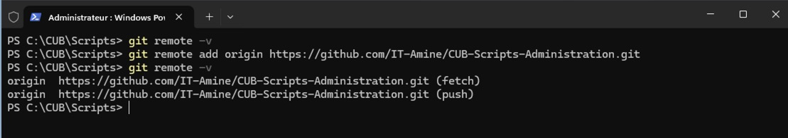

## Question 20 : Quelle commande permet d'envoyer les commits locaux vers Github ?

git push

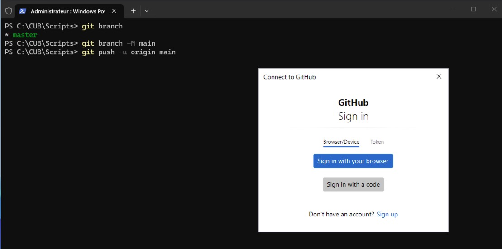

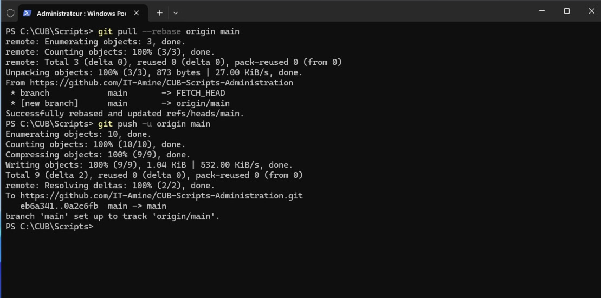

## Question 21 : Quelle différence existe-t-il entre "git commit" et "git push" ?

git commit enregistre une nouvelle version uniquement sur l'ordinateur local. git push transfère ces enregistrements locaux vers le serveur distant (GitHub).

## Question 22 : Avant d'exécuter "git push", cette modification est-elle déjà visible sur Github ? Pourquoi ?

Non, car Git est un système décentralisé. Les modifications restent bloquées sur le PC local tant qu'on n'a pas explicitement ordonné à Git de les envoyer sur le réseau avec le push.

## Question 23 : Quelle différence faites-vous entre "git init" et "git clone" ?

La différence, c'est que "git clone" permet de copier intégralement un dépôt distant existant (avec tout son historique) sur sa machine locale via une URL. "git init", en revanche, sert à initialiser un tout nouveau dépôt Git local vide dans un dossier existant.

## Question 24 : Pourquoi est-il important de récupérer les dernières modifications avant de commencer à travailler sur un projet partagé ?

Pour éviter les conflits de fusion (merge conflicts). Si un collègue a modifié un script PowerShell entre-temps, il faut se synchroniser (via git pull) pour travailler sur la version la plus à jour et ne pas écraser son travail.

## Question 25 : Comment Git indique-t-il la branche actuellement utilisée ?

Avec la commande "git branch", la branche active est précédée d'une étoile (*) et souvent affichée en vert. La commande "git status" indique également "Sur la branche <nom_de_la_branche>" en première ligne.

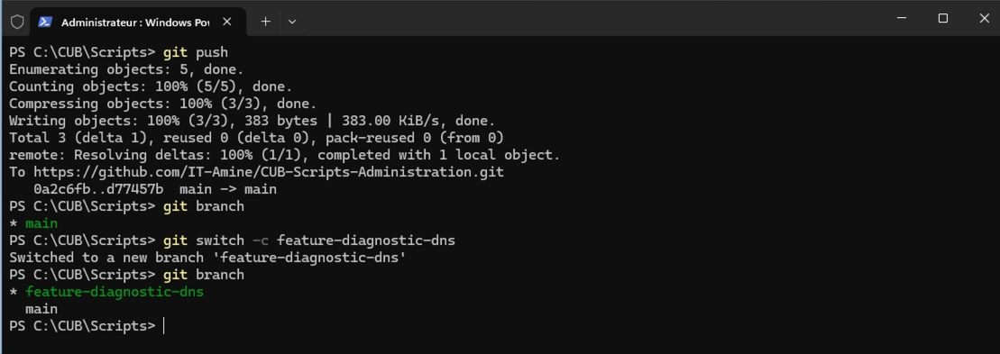

## Question 26 : Quel est l'intérêt de travailler dans une branche plutôt que directement dans "main" ?

Cela permet de développer une nouvelle fonctionnalité ou de tester un script sans risquer de casser la version stable de production (la branche main). C'est un espace de travail isolé.

## Question 27 : La modification réalisée dans "feature-diagnostic-dns" est-elle présente dans "main" ? Pourquoi ?

Non, pas tant qu'on n'a pas fusionné les branches. Les modifications restent strictement isolées dans la branche "feature-diagnostic-dns" jusqu'à ce qu'on décide de les intégrer.

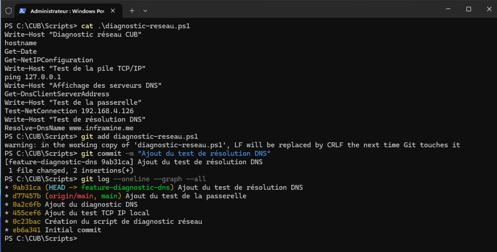

## Question 28 : Quel est le rôle de la commande "git merge" ?

Elle permet de fusionner l'historique et les modifications d'une branche (par exemple une branche de test) vers la branche sur laquelle on se trouve actuellement (généralement vers main) pour y intégrer le travail terminé.

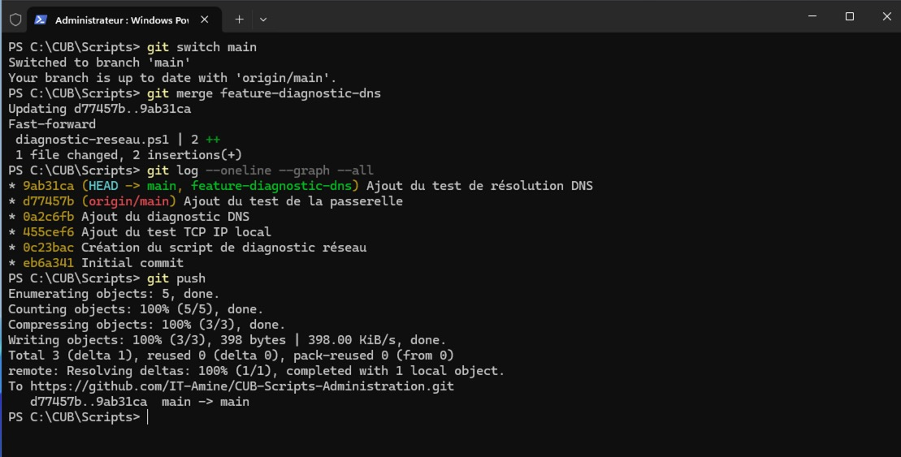

## Question 29 : La branche apparaît-elle maintenant sur Github ?

Pas automatiquement après sa création locale. Il faut la pousser explicitement vers le dépôt distant avec une commande comme "git push -u origin nom-de-la-branche".

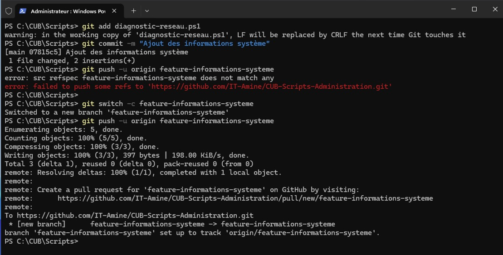

## Question 30 : Quelle différence existe t-il entre une branche uniquement locale et une branche publiée sur Github ?

Une branche locale n'existe que sur le serveur Windows local : personne d'autre ne peut la voir ou y contribuer. Une branche publiée sur GitHub (distante) est sauvegardée sur le cloud et permet aux autres membres de l'équipe de la consulter, de la tester ou de travailler dessus.

## Question 31 : Quel est l'intérêt d'une Pull Request ?

Elle permet de proposer l'intégration de son code (une branche) vers la branche principale. C'est un espace de discussion où l'équipe peut relire le code, le tester et l'approuver avant la fusion définitive.

## Question 32 : Pourquoi est-il préférable de faire vérifier une modification avant son intégration dans "main" ?

Pour s'assurer que le code respecte les standards de l'entreprise, vérifier qu'aucune information sensible n'est poussée par erreur, et éviter d'introduire des bugs qui pourraient bloquer la production.

## Question 33 : Pourquoi Git ne choisit-il pas automatiquement une des deux versions (lors d'un conflit) ?

Git est un outil technique, il n'a pas le contexte fonctionnel. Si deux administrateurs ont modifié la même ligne différemment, Git ne peut pas deviner quelle logique est la bonne. Il préfère s'arrêter et demander à un humain de trancher pour éviter toute perte de données ou erreur logique.

## Question 34 : Qui doit décider du contenu à conserver ?

L'administrateur ou le développeur qui effectue l'opération de fusion (merge). En cas de doute, il doit se concerter avec la personne qui a écrit l'autre version du code pour prendre la bonne décision.

## Question 35 : Après correction manuelle du conflit, quelles opérations Git permettent d'enregistrer la résolution ?

Il faut d'abord utiliser git add <nom_du_fichier_resolu> pour indiquer à Git que le conflit est réglé, puis exécuter git commit pour valider définitivement la fusion.

## Question 36 : Compléter le rôle des commandes suivantes :

    git init : Initialiser un nouveau dépôt Git local vide.

    git status : Afficher l'état du répertoire de travail et des fichiers indexés/non indexés.

    git diff : Afficher les différences ligne par ligne entre les fichiers modifiés et la dernière version validée.

    git add : Ajouter des fichiers à l'index pour préparer le prochain commit.

    git commit : Enregistrer un "instantané" des modifications indexées dans l'historique local.

    git log --oneline : Afficher l'historique des commits de manière simplifiée et condensée (une ligne par commit).

    git restore : Annuler les modifications non validées d'un fichier pour revenir à la version précédente.

    git clone : Copier un dépôt distant (ex: depuis GitHub) vers sa machine locale.

    git pull : Récupérer les nouveautés du dépôt distant et les fusionner directement dans la branche locale.

    git push : Envoyer les commits enregistrés localement vers le serveur distant.

    git branch : Lister, créer ou supprimer des branches de travail.

    git switch : Basculer d'une branche à une autre (remplace l'ancienne commande git checkout).

    git merge : Fusionner le contenu d'une branche dans la branche active (ex: intégrer une feature dans main).

## Question 37 : Expliquer en quelques lignes la différence entre Git, Github, un commit, une branche, une fusion et une Pull Request ?

Git est l'outil local gérant l'historique de versions, tandis que GitHub est la plateforme en ligne hébergeant le code pour collaborer. Un commit est une sauvegarde ponctuelle du projet. Une branche est un environnement isolé pour développer une nouveauté sans risquer de casser le projet stable. Une fusion rassemble le code de deux branches. Enfin, la Pull Request est la demande officielle sur GitHub pour faire valider et approuver cette fusion par l'équipe.

## Question 38 : Un administrateur exécute "git add ." puis "git commit", mais oublie "git push". Les autres administrateurs peuvent-ils voir ce commit sur Github ? Justifier.

Non, ils ne peuvent pas le voir. Les commandes git add et git commit ne travaillent que sur l'ordinateur local de l'administrateur. Tant que la commande git push n'est pas exécutée, les modifications ne sont pas envoyées sur le réseau vers les serveurs de GitHub.

## Question 39 : Un administrateur doit développer une fonctionnalité qui n'est pas encore validée. Doit-il modifier directement "main" ou créer une branche dédiée ? Justifier.

Il doit absolument créer une branche dédiée. Modifier directement "main" risque d'introduire des bugs bloquants dans des scripts utilisés en production. La branche permet de développer, tester, et faire valider la fonctionnalité en toute sécurité sans impacter le reste du système.
