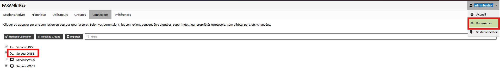
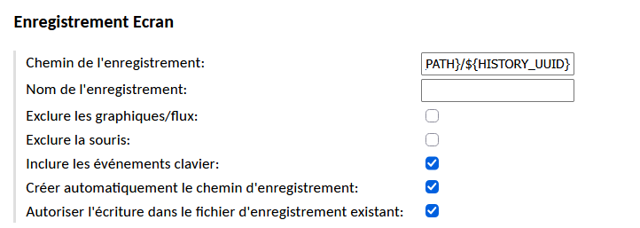
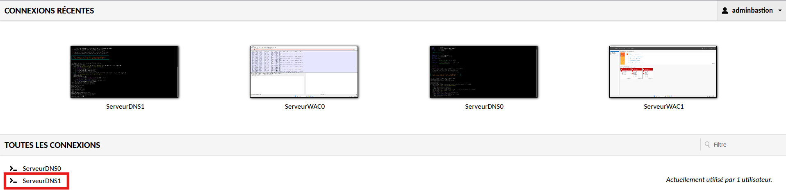
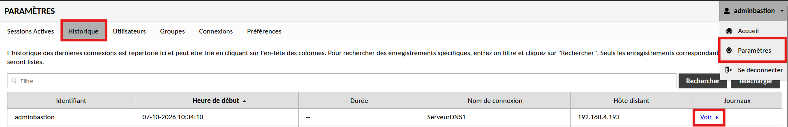

# Configuration de l'enregistrement des connexions

!!! abstract "Informations sur le document"
    - **Auteur :** KADA Amine
    - **Classe :** BTS SIO 2 - Option SISR
    - **Date :** 07/10/2026
    - **Sujet :** Configuration de l'enregistrement des connexions

---

## Contexte

Cette procédure détaille la configuration de l'enregistrement systématique des sessions de connexion (incluant la capture vidéo et les événements clavier). Dans une démarche orientée SRE et sécurité, la traçabilité complète des interventions sur les serveurs garantit l'observabilité des actions administrateurs, facilite les audits de conformité et permet le rejeu des incidents.

## Configuration de l'enregistrement

3.1.  **Sélection de la connexion.** Se rendre dans les Paramètres > Connexions, puis sélectionner la connexion cible à configurer.

3.2.  **Paramétrage de la capture.** Dans la section *Paramètres de la connexion*, appliquer la configuration de l'enregistrement d'écran.

> [!info] Utilisation de variables
> L'utilisation des variables `${HISTORY_PATH}` et `${HISTORY_UUID}` permet d'automatiser et d'isoler le stockage des enregistrements par session.

Définir les paramètres suivants :

- Chemin de l'enregistrement : `${HISTORY_PATH}/${HISTORY_UUID}`
- Inclure les événements clavier : `Coché`
- Créer automatiquement le chemin d'enregistrement : `Coché`
- Autoriser l'écriture dans le fichier d'enregistrement existant : `Coché`

## Vérification {#4-verification}

4.1.  **Génération d'événements de test.** Démarrer une session sur un serveur depuis les connexions configurées et exécuter quelques commandes d'administration courantes pour générer de la donnée d'historique.

4.2.  **Consultation des logs d'enregistrement.** Naviguer vers Paramètres > Historique et cliquer sur *Voir* pour accéder aux enregistrements.

