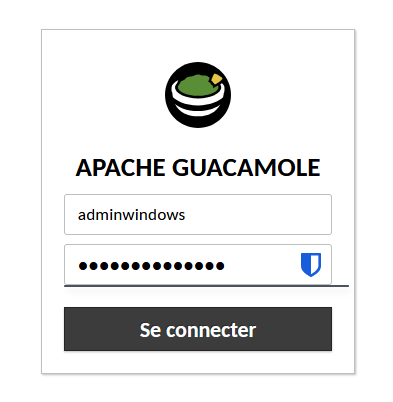
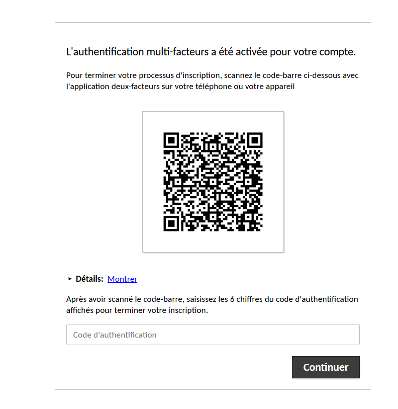

# Activation de l'authentification multifacteur (TOTP) sur Guacamole


!!! abstract "Informations sur le document"
    - **Auteur :** KADA Amine
    - **Classe :** BTS SIO 2 - Option SISR
    - **Date :** 07/10/2026
    - **Sujet :** Activation de l'authentification multifacteur (TOTP) sur Guacamole

---

## Contexte

Dans le cadre du durcissement de notre bastion d'administration, cette procédure détaille l'activation de l'authentification multifacteur (MFA) basée sur le protocole TOTP pour Apache Guacamole. L'activation au niveau du serveur est gérée via Infrastructure as Code (IaC) en injectant les variables d'environnement au niveau de la stack de conteneurisation, garantissant une configuration déclarative et reproductible de l'environnement CUB.

## Configuration de l'infrastructure (IaC)

3.1.  **Déclaration de la variable d'environnement.** Éditer le fichier de déploiement [docker-compose.yaml](https://cub.bts.loutik.fr/05-cybersecurite/bastion/assets/installation-guacamole/docker-compose.yaml) de la stack Guacamole afin d'activer l'extension TOTP au niveau du service de l'application.

```yaml title="docker-compose.yaml" hl_lines="4"
services:
  guacamole:
    environment:
      TOTP_ENABLED: "true"
```

* `TOTP_ENABLED: "true"` : Variable d'environnement déclenchant l'activation et le chargement du module d'authentification TOTP au démarrage du conteneur Guacamole.

3.2. **Redéploiement du service.** Appliquer la nouvelle configuration déclarative pour recréer le conteneur avec la fonctionnalité activée.

```bash
docker compose up -d guacamole
```

* `-d` : Détache l'exécution du processus en arrière-plan.

## Enrôlement et validation utilisateur {#4-enrolement-et-validation-utilisateur}

4.1.  **Initiation de la session.** Se connecter à l'interface web de Guacamole avec un compte utilisateur valide. Lors de cette première connexion post-activation, le système intercepte la session pour forcer l'enrôlement MFA avant de délivrer les accès aux ressources.



4.2.  **Configuration du dispositif d'authentification.** À l'aide d'une application d'authentification sécurisée sur téléphone (ex: Aegis, FreeOTP, Google Authenticator), scanner le QR code affiché à l'écran, puis saisir le code à 6 chiffres généré dynamiquement pour valider l'association cryptographique.


