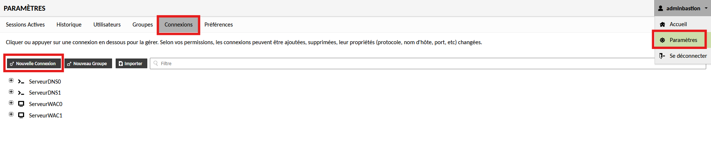
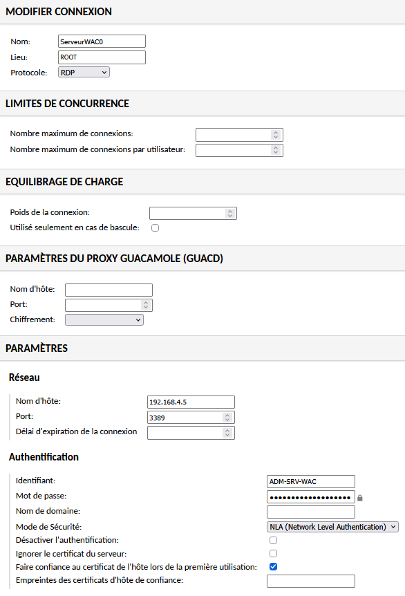

# Configuration d'une Connexion RDP sur Guacamole

!!! abstract "Informations sur le document"
    - **Auteur :** KADA Amine
    - **Classe :** BTS SIO 2 - Option SISR
    - **Date :** 01/10/2026
    - **Sujet :** Configuration d'une Connexion RDP sur Guacamole

---

## Contexte

L'objectif de cette procédure est de standardiser l'instanciation des accès distants via le protocole RDP pour l'ensemble du parc de serveurs et postes de travail Windows de l'infrastructure CUB. Elle documente les paramètres de configuration obligatoires, en particulier l'authentification au niveau du réseau (NLA) et la gestion des certificats hôtes, afin de garantir l'établissement sécurisé et systématique des sessions au travers du bastion.

## Déploiement d'une connexion RDP {#3-deploiement-dune-connexion-rdp}

3.1. **Initialisation de la ressource.** Depuis l'interface web d'administration de Guacamole, naviguer dans le menu `Paramètres` > `Connexions`, puis cliquer sur le bouton `Nouvelle connexion`.

3.2. **Définition des paramètres protocolaires.** Renseigner les identifiants et informations réseaux ainsi que les paramètres d'authentification de la machine cible.

- `Nom` : Définir un nom explicite respectant la convention de nommage de l'infrastructure (exemple : `ServeurWAC1`).
- `Protocole` : Sélectionner le protocole `RDP`.
- `Réseau` : Saisir l'adresse IP de l'équipement Windows cible ainsi que le port d'écoute (par défaut `3389`).
- `Authentification` : Saisir l'**identifiant**, le **mot de passe**. Puis mettre le mode de sécurité à **NLA** et **Faire confiance au certificat de l'hôte lors de la première utilisation**.

3.3. **Configuration de l'enregistrement de session.** Toujours dans la section *Paramètres de la connexion*, activer l'enregistrement d'écran et la capture des événements clavier afin d'assurer la traçabilité et l'auditabilité des interventions sur le bastion.

> [!info] Standardisation du stockage
> L'utilisation des variables `${HISTORY_PATH}` et `${HISTORY_UUID}` permet de générer dynamiquement l'arborescence et le nommage des fichiers d'enregistrement, s'alignant ainsi sur les bonnes pratiques de provisionnement.

- Chemin de l'enregistrement : `${HISTORY_PATH}/${HISTORY_UUID}`
- Inclure les événements clavier : `Coché`
- Créer automatiquement le chemin d'enregistrement : `Coché`
- Autoriser l'écriture dans le fichier d'enregistrement existant : `Coché`

