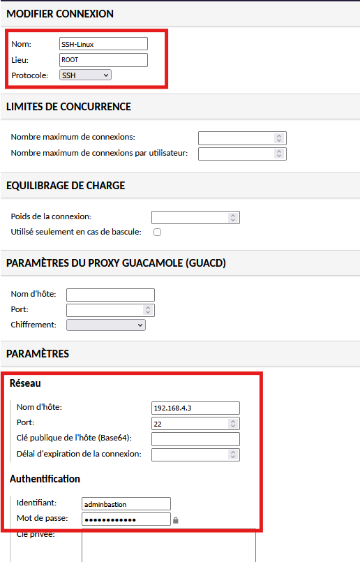
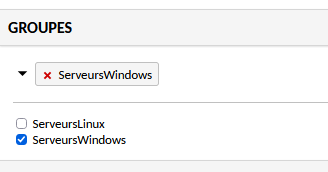
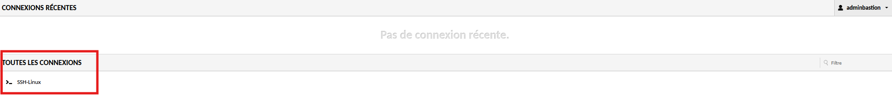

# Configuration d'une Connexion SSH sur Guacamole

!!! abstract "Informations sur le document"
    - **Auteur :** KADA Amine
    - **Classe :** BTS SIO 2 - Option SISR
    - **Date :** 01/10/2026
    - **Sujet :** Configuration d'une Connexion SSH sur Guacamole

---

## Contexte

L'objectif de cette procédure est de documenter l'intégration sécurisée d'un équipement Linux via le protocole SSH au sein du bastion. L'opération inclut le renseignement des paramètres réseaux, l'affectation logique à un groupe de connexions pour le maintien de l'architecture RBAC, et la validation de l'étanchéité des droits d'accès entre les différents profils d'administration déléguée.

## Déploiement d'une connexion SSH {#3-deploiement-dune-connexion-ssh}

3.1. **Initialisation des paramètres protocolaires.** Depuis l'interface web d'administration de Guacamole, naviguer dans le menu `Paramètres` > `Connexions`, puis cliquer sur le bouton `Nouvelle connexion`. Renseigner les caractéristiques de la machine cible :

- `Nom` : Définir un identifiant explicite respectant la convention de nommage (exemple : `ServeurDNS0`).
- `Protocole` : Sélectionner le protocole `SSH`.
- `Réseau` : Saisir l'adresse IP du serveur cible ainsi que le port de communication (par défaut `22`).

3.2. **Affectation du groupe.** Aller dans `Utilisateurs` > `Selectionner un utilisateur` et ajouter le bon groupe. Afin de garantir l'application des stratégies de contrôle d'accès définies au niveau des rôles utilisateurs, descendre dans les paramètres de la connexion jusqu'à l'arborescence des groupes. Cochez l'appartenance de la nouvelle connexion au groupe correspondant à son environnement (exemple : groupe `Linux`).

> [!info] Structuration des accès
> L'intégration systématique des nouvelles ressources au sein de groupes logiques est indispensable. Cela garantit que les permissions associées aux groupes de sécurité (comme `ServeursLinux`) soient appliquées dynamiquement à chaque nouvel équipement sans action supplémentaire.

3.3. **Validation.** Procéder à une vérification croisée des accès afin de s'assurer de la bonne ségrégation des flux et du respect du principe de moindre privilège.

- Se déconnecter de la session d'administration globale.
- S'authentifier avec le compte `adminlinux` : la connexion SSH nouvellement créée doit être visible et l'accès interactif au terminal doit être pleinement fonctionnel.
- S'authentifier avec le compte `adminwindows` : la connexion SSH doit être totalement invisible depuis l'interface de l'utilisateur.

> [!success] Validation de conformité
> Si la ressource n'est listée que pour les utilisateurs disposant explicitement des droits sur l'environnement Linux, la politique d'isolation RBAC est validée et opérationnelle.

3.4. **Configuration de l'enregistrement de session.** Toujours dans la section *Paramètres de la connexion*, activer l'enregistrement d'écran et la capture des événements clavier afin d'assurer la traçabilité et l'auditabilité des interventions sur le bastion.

> [!info] Standardisation du stockage
> L'utilisation des variables `${HISTORY_PATH}` et `${HISTORY_UUID}` permet de générer dynamiquement l'arborescence et le nommage des fichiers d'enregistrement, s'alignant ainsi sur les bonnes pratiques de provisionnement.

- Chemin de l'enregistrement : `${HISTORY_PATH}/${HISTORY_UUID}`
- Inclure les événements clavier : `Coché`
- Créer automatiquement le chemin d'enregistrement : `Coché`
- Autoriser l'écriture dans le fichier d'enregistrement existant : `Coché`

