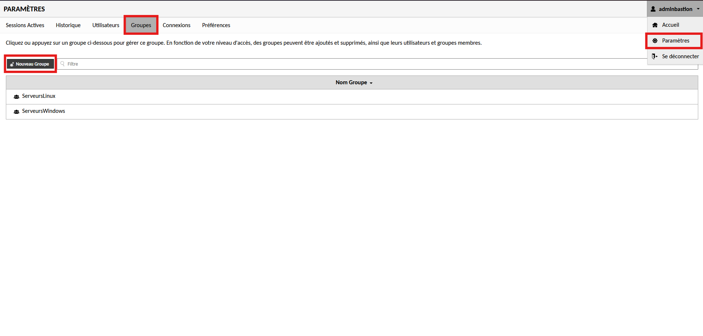
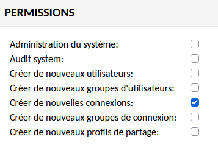

# Création de Groupes de Sécurité sur Guacamole

---

## Informations

- **Auteur :** KADA Amine
- **Date :** 01/10/2026
- **Domaine :** Cybersécurité

---

## 1. Sommaire

- [1. Sommaire](#1-sommaire)
- [2. Contexte](#2-contexte)
- [3. Procédure de création d'un groupe](#3-procedure-de-creation-dun-groupe)

## 2. Contexte

La gestion des accès au sein du bastion Guacamole repose sur un modèle RBAC (Role-Based Access Control). L'instanciation de groupes permet de segmenter logiquement les utilisateurs par périmètre d'intervention (systèmes d'exploitation, réseaux, bases de données) et de centraliser l'attribution des permissions. Cette procédure standardisée documente la méthode de provisionnement d'un groupe d'administration et peut être itérée pour tout nouveau besoin de délégation des accès au sein de l'infrastructure CUB.

## 3. Procédure de création d'un groupe {#3-procedure-de-creation-dun-groupe}

3.1. **Accès au gestionnaire de groupes.** Depuis l'interface web d'administration de Guacamole, naviguer dans le menu `Paramètres` > `Groupes`, puis cliquer sur le bouton `Nouveau groupe`.

3.2. **Définition du groupe et attribution des privilèges.** Renseigner un nom de groupe explicite caractérisant la portée des accès (par exemple : `ServeursLinux`, `EquipementsReseau`, `ServeursBdd`). Configurer ensuite les permissions globales attribuées au groupe. Pour une délégation standard permettant l'ajout d'équipements, cocher uniquement la permission `Créer de nouvelles connexions`.

