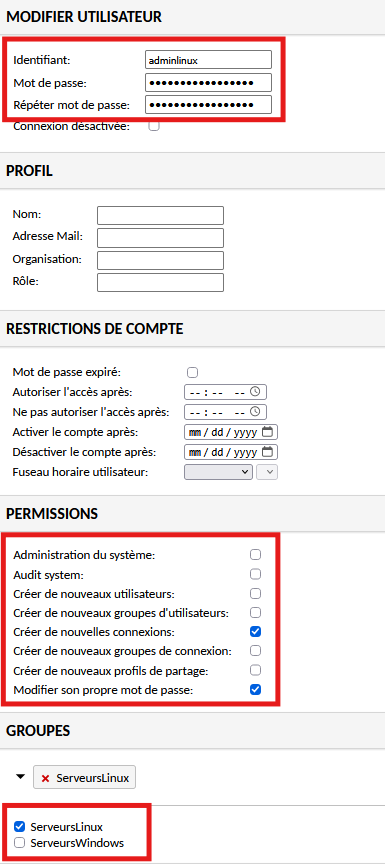

# Création des Utilisateurs sur le Bastion

!!! abstract "Informations sur le document"
    - **Auteur :** KADA Amine
    - **Classe :** BTS SIO 2 - Option SISR
    - **Date :** 01/10/2026
    - **Sujet :** Création des Utilisateurs sur le Bastion

---

## Contexte

Afin de mettre en œuvre le contrôle d'accès basé sur les rôles (RBAC) au sein du bastion Guacamole, des comptes dédiés à l'administration de périmètres spécifiques (Linux et Windows) sont provisionnés. Cette ségrégation permet de restreindre l'étendue des accès et garantit le respect du principe de moindre privilège.

## Création des comptes d'administration déléguée {#3-creation-des-comptes-dadministration-deleguee}

3.1. **Création du compte d'administration Linux.** Depuis le menu `Paramètres` (en haut à droite dans la page d'accueil) > `Utilisateurs`, configurer le profil `adminlinux`.

Attribuer les permissions suivantes :

- `Changer son propre mot de passe`
- `Créer de nouvelles connexions`

Dans la section des groupes, affecter l'utilisateur au groupe `ServeursLinux` (ou son groupe).

