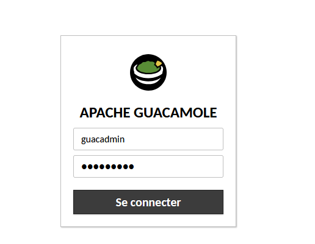
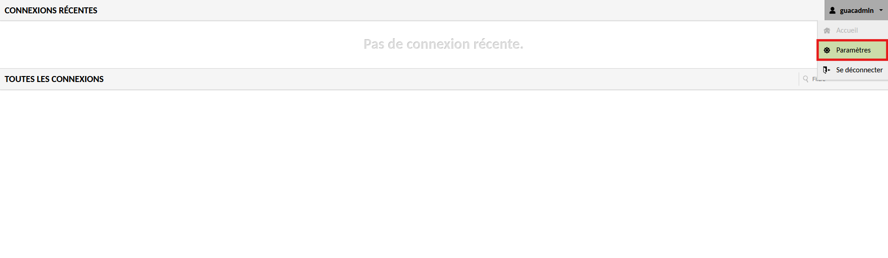
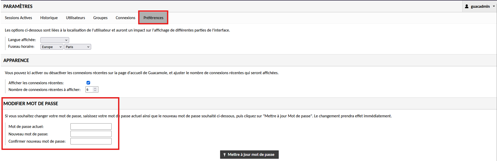

# Installation du Bastion Guacamole


---

## Informations

- **Auteur :** KADA Amine
- **Date :** 01/10/2026
- **Domaine :** Cybersécurité

---

## 1. Sommaire

- [1. Sommaire](#1-sommaire)
- [2. Contexte](#2-contexte)
- [3. Préparation de l'environnement de travail](#3-preparation-de-lenvironnement-de-travail)
- [4. Configuration du Reverse Proxy et Certificats SSL](#4-configuration-du-reverse-proxy-et-certificats-ssl)
- [5. Déploiement de l'Infrastructure Docker](#5-deploiement-de-linfrastructure-docker)
- [6. Post-Installation et Sécurisation](#6-post-installation-et-securisation)

## 2. Contexte

Le bastion Guacamole agit en tant que point d'accès centralisé et sécurisé pour l'administration des équipements et serveurs de l'infrastructure CUB. En s'appuyant sur la suite Apache Guacamole, il fournit des connexions RDP, SSH et VNC "clientless" directement via un navigateur web. Le déploiement s'effectue de manière conteneurisée à l'aide de Docker Compose, intégrant un service PostgreSQL pour la gestion des accès et un reverse proxy Nginx pour le chiffrement des flux en HTTPS.

## 3. Préparation de l'environnement de travail {#3-preparation-de-lenvironnement-de-travail}

3.1. **Création du répertoire de travail.** Initialisation de l'arborescence principale pour l'hébergement des volumes et configurations Docker.

```bash
sudo mkdir -p /opt/guacamole
cd /opt/guacamole
sudo chown etudiant:etudiant -R /opt/guacamole
```

* `sudo` : Exécution avec les privilèges administrateur.
* `-p` : Création des répertoires parents si inexistants.
* `-R` : Application de la récursivité pour les droits de propriété.

> [!warning] Droits et Groupes
> Pensez à ajouter l'utilisateur au groupe docker via `sudo adduser etudiant docker`. Il est nécessaire de redémarrer la connexion SSH pour que l'application de ce nouveau groupe soit effective.

3.2. **Initialisation de la base de données.** Création du dossier d'initialisation et exécution du script de génération des tables PostgreSQL.

```bash
mkdir -p ./initdb
docker run --rm 'guacamole/guacamole:1.6.0' /opt/guacamole/bin/initdb.sh --postgresql > ./initdb/initdb.sql
```

* `--rm` : Le conteneur éphémère sera automatiquement supprimé à la fin de l'opération.
* `--postgresql` : Spécifie le type de base de données à initialiser.

## 4. Configuration du Reverse Proxy et Certificats SSL

4.1. **Création de l'arborescence Nginx.** Préparation des dossiers pour le stockage des certificats et du template de configuration Nginx.

```bash
mkdir -p ./nginx/ssl
mkdir -p ./nginx/templates
```

4.2. **Génération du certificat auto-signé.** Création d'un certificat SSL et de sa clé privée pour sécuriser les flux web en HTTPS.

```bash
openssl req -nodes -newkey rsa:2048 -new -x509 \
-keyout nginx/ssl/self-ssl.key \
-out nginx/ssl/self.cert \
-subj '/C=FR/ST=Centre-Val-de-Loire/L=Tours/O=CUB/CN=bastion0.dortmund.cub.sioplc.fr'
```

* `-nodes` : Ne pas chiffrer la clé privée (sans passphrase).
* `-newkey rsa:2048` : Génère une nouvelle clé RSA de 2048 bits.
* `-subj` : Permet de renseigner les informations du certificat directement en ligne de commande.

4.3. **Configuration du template Nginx.** Définition des règles de reverse proxy.

```bash title="Création du fichier de configuration"
vim /opt/guacamole/nginx/templates/guacamole.conf.template
```

[📄 Consulter guacamole.conf.template](./assets/installation-guacamole/guacamole.conf.template)

## 5. Déploiement de l'Infrastructure Docker {#5-deploiement-de-linfrastructure-docker}

5.1. **Configuration des variables d'environnement.** Renseignement des secrets et paramètres globaux de la stack.

```bash title="Création du fichier d'environnement"
vim /opt/guacamole/.env
```

[📄 Consulter .env](./assets/installation-guacamole/.env.example)

5.2. **Déclaration des services.** Configuration du fichier définissant les services Guacamole, PostgreSQL et Nginx.

```bash title="Création de la stack Docker Compose"
# Créer le dossier pour stocker les enregistrements de sessions
mkdir /opt/guacamole/session-recording

vim /opt/guacamole/docker-compose.yml
```

[📄 Consulter docker-compose.yml](./assets/installation-guacamole/docker-compose.yaml)

## 6. Post-Installation et Sécurisation {#6-post-installation-et-securisation}

6.1. **Première authentification.** Accéder à l'interface web via l'adresse IP du bastion et s'authentifier avec les identifiants initiaux.

* Utilisateur : `guacamole` *(ou `guacadmin`)*
* Mot de passe : `guacamole` *(ou `guacadmin`)*



6.2. **Accès au menu des paramètres.** Se rendre dans la zone d'administration en haut à droite.



6.3. **Modification du mot de passe par défaut.** Naviguer dans l'onglet `Préférences`, puis dans la section `MODIFIER MOT DE PASSE`. Renseigner un mot de passe robuste, puis cliquer sur **Mettre à jour mot de passe**.

> [!note] Compte Administrateur
> Le mot de passe par défaut historique du compte administrateur est `guacadmin`. Cette modification est impérative avant toute mise en production !


