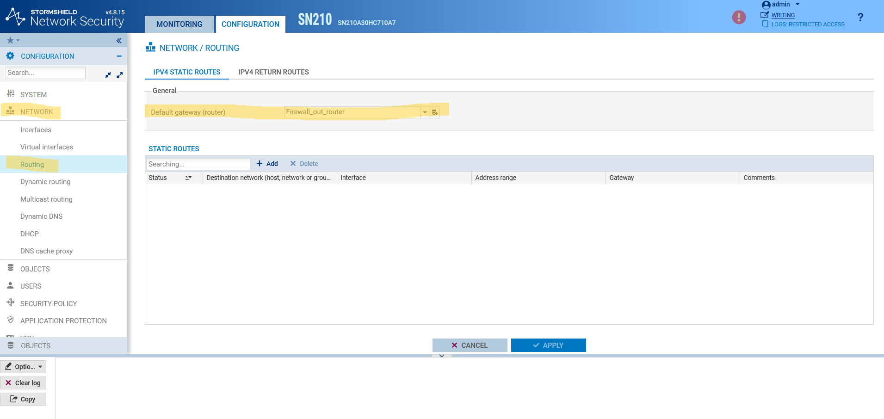
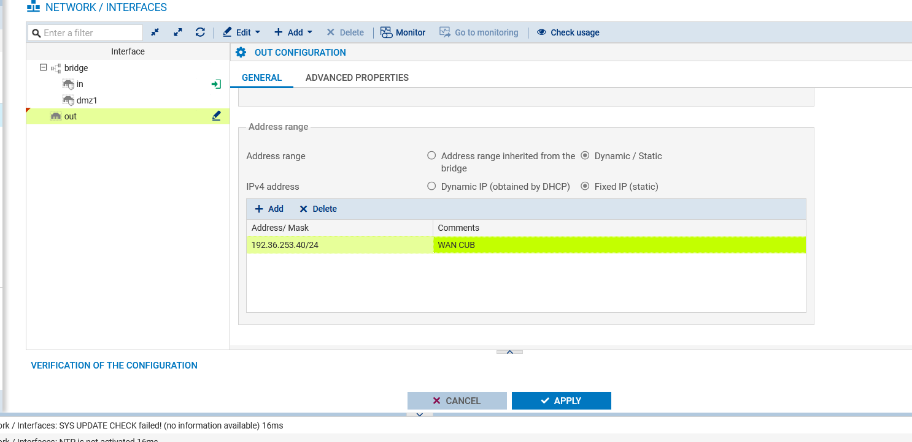

# BLOC 3 - Résolution de l'erreur d'objets dérivés sur ethernet0

    
<strong>Auteur :</strong> KADA Amine

    
<strong>Classe :</strong> BTS SIO 2 - Option SISR

    
<strong>Date :</strong> 09/09/2026

    
<strong>Contexte :</strong> Configuration Résolution de l'erreur d'objets dérivés sur ethernet0

---

## Informations

- **Auteur :** Amine Kada
- **Date :** 09/09/2026
- **Domaine :** Réseau

---

## 1. Sommaire

- [Contexte](#2-contexte)
- [Dissociation de l'object de routage](#3-dissociation-de-lobjet-de-routage)
- [Configuration de l'interface WAN](#4-configuration-de-linterface-wan)

## 2. Contexte

Lors de la configuration d'une adresse IP fixe sur l'interface WAN (`ethernet0`), une erreur de conflit survient en raison d'objets de routage dérivés. L'interface est verrouillée par la passerelle par défaut `firewall_out_router`. Ce composant bloque les modifications réseau. Cette procédure vise à désactiver ce lien de routage afin d'autoriser l'assignation de l'IP statique, permettant ainsi l'interconnexion au réseau externe de l'infrastructure CUB.

## 3. Dissociation de l'objet de routage

3.1.  **Désactivation de la passerelle par défaut.** Retirer l'association bloquante sur l'interface en modifiant le statut du routeur par défaut. 

* **Configuration** > **Network** > **Routing** > **default gateway (router)** = `none`

- `Network > Routing` : Chemin de navigation pour accéder aux paramètres des routes réseau.
- `none` : Valeur remplaçant l'objet `firewall_out_router` pour libérer l'interface WAN de ses dépendances.

## 4. Configuration de l'interface WAN

4.1.  **Assignation de l'adresse IP.** Configurer l'adresse IP fixe requise sur l'interface WAN désormais débloquée.

* **Configuration** > **Network** > **Interfaces** > **Out (WAN)** > **Apply**

- `Out (WAN)` : Ciblage de l'interface externe (`ethernet0`) pour la saisie de l'adresse IP statique.
- `Apply` : Validation des paramètres pour forcer l'application de la nouvelle configuration réseau.
