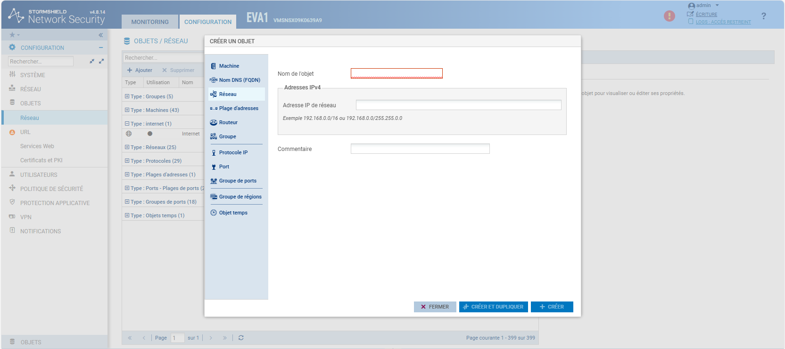
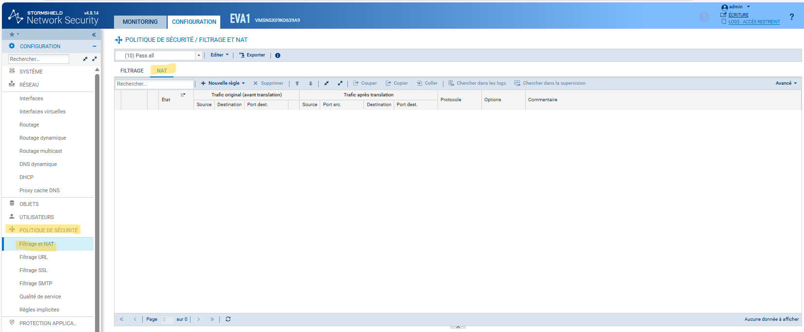
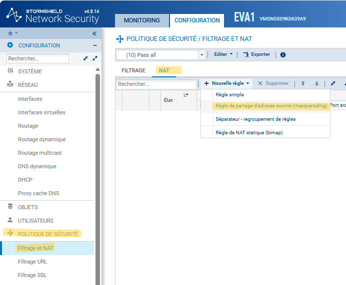
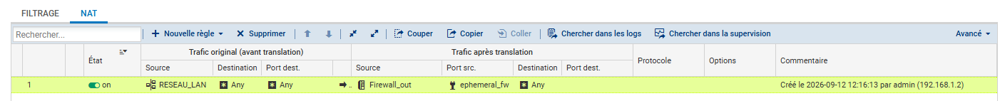

# BLOC 3 - Configuration du NAT sur Stormshield

    
<strong>Auteur :</strong> KADA Amine

    
<strong>Classe :</strong> BTS SIO 2 - Option SISR

    
<strong>Date :</strong> 12/09/2026

    
<strong>Contexte :</strong> Configuration Configuration du NAT sur Stormshield

---

## Informations

- **Auteur :** Amine Kada
- **Date :** 12/09/2026
- **Domaine :** Réseau

---

## 1. Sommaire

- [1. Sommaire](#1-sommaire)
- [2. Contexte](#2-contexte)
- [3. Création des objets réseaux](#3-creation-des-objets-reseaux)
- [4. Configuration de la politique NAT](#4-configuration-de-la-politique-nat)

## 2. Contexte

Déploiement du service de translation d'adresses (NAT) via l'interface graphique du pare-feu Stormshield. Ce composant est indispensable pour assurer le routage et l'accès vers l'extérieur (Masquerading) des réseaux internes de l'infrastructure.

## 3. Création des objets réseaux {#3-creation-des-objets-reseaux}

3.1. **Création d'un objet réseau depuis l'IHM.** Accéder au menu **Objets** > **Tous les objets**, cliquer sur le bouton **Ajouter** et sélectionner **Réseau**. 

- `Nom de l'objet` : Identifiant de la ressource. Doit impérativement respecter la nomenclature.
- `Adresse IP de réseau` : Plage réseau avec prise en charge de la notation CIDR.

> [!warning] Standard de nommage
> L'utilisation des préfixes `RESEAU_<NOM-RESEAU>` et `MACHINE_<NOM-MACHINE>` est obligatoire dans l'interface. Cela garantit la cohérence visuelle et réduit les erreurs lors du ciblage dans les politiques de filtrage.

## 4. Configuration de la politique NAT

4.1. **Accès au module NAT.** Dans le bandeau latéral de configuration, naviguer vers **Politique de sécurité** > **Filtrage et NAT**, puis cliquer sur l'onglet **NAT**.

4.2. **Création de la règle de Masquerading.** Dans le tableau de translation, cliquer sur **Nouvelle règle** et sélectionner **Règle de partage d'adresse source (masquerading)**.

4.3. **Paramétrage des champs et documentation.** Glisser-déposer les objets depuis la bibliothèque latérale vers les cellules de la règle, puis renseigner un commentaire sur les éléments qui sont NAT.

- `Source` : L'objet défini lors de l'étape 3 (ex: `RESEAU_LAN`).
- `Trafic après translation (Source)` : L'interface de sortie publique du pare-feu (ex: `Firewall_out`).

> [!tip] Activation
> Assurez-vous que l'état de la règle est positionné sur "ON" (en vert) et validez la politique en cliquant sur "Sauvegarder et appliquer" pour que le routeur prenne en compte la nouvelle configuration NAT.
