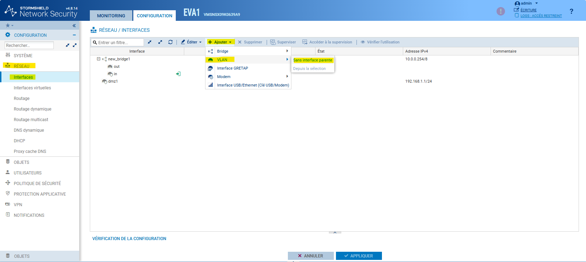
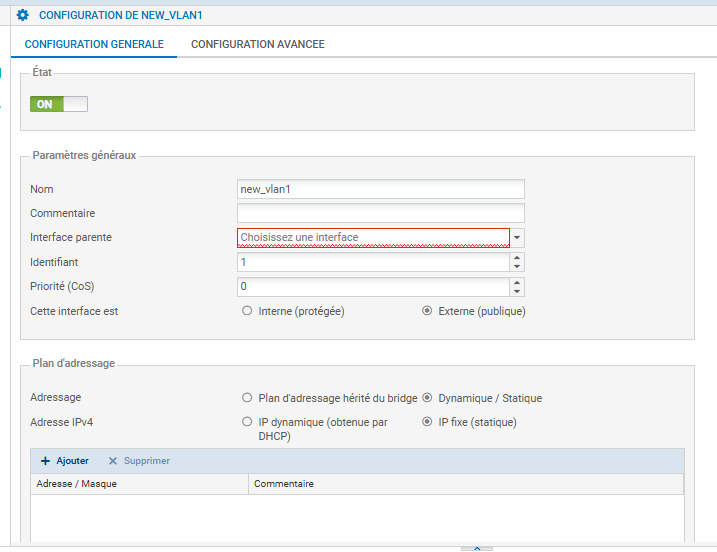

# Configuration d'une sous-interface (VLAN 802.1Q) sur Stormshield


---

## Informations

- **Auteur :** Amine Kada
- **Date :** 12/09/2026
- **Domaine :** Réseau

---

## 1. Sommaire

- [1. Sommaire](#1-sommaire)
- [2. Contexte](#2-contexte)
- [3. Création de la sous-interface VLAN](#3-creation-de-la-sous-interface-vlan)
- [4. Configuration IP de la sous-interface](#4-configuration-ip-de-la-sous-interface)
- [5. Contrôle d'état](#5-controle-detat)

## 2. Contexte

Le déploiement d'une sous-interface tagguée (VLAN 802.1Q) sur un pare-feu Stormshield permet de segmenter le trafic réseau sur une même interface physique (lien Trunk). Cette configuration est indispensable pour le routage inter-VLAN et l'application des politiques de filtrage (Firewalling) isolées par domaine de diffusion.

## 3. Création de la sous-interface VLAN {#3-creation-de-la-sous-interface-vlan}

3.1. **Ajout de l'interface virtuelle.** Dans le menu **CONFIGURATION** > **RÉSEAU** > **INTERFACES**, sélectionner **Ajouter**, puis **VLAN** et **Sans interface parente**.



## 4. Configuration IP de la sous-interface

4.1. **Définition du plan d'adressage.** Activer la sous-interface et lui attribuer une adresse IP statique qui agira en tant que passerelle par défaut (Gateway) pour les hôtes raccordés à ce VLAN ainsi que choisir l'interface physique parente.



- `État` : `ON` pour activer administrativement la sous-interface.
- `Interface parente` : Nom de l'interface parente.
- `Identifiant` : L'ID du vlan.
- `Adresse IPv4` : Sélectionner `IP fixe (statique)`.
- `Adresse / Masque` : Renseigner l'adresse IP et le préfixe CIDR (ex: `10.10.10.254/24`).

4.2. **Validation.** Cliquer sur "Appliquer" dans le panneau de l'interface, puis sur le bouton global "APPLIQUER" pour écrire la configuration en mémoire.

## 5. Contrôle d'état {#5-controle-detat}

5.1. **Vérification CLI.** Se connecter en SSH à l'appliance pour valider la bonne création de l'interface virtuelle dans le noyau.

```bash
ifconfig in.10

```

* `ifconfig` : Commande UNIX permettant d'afficher la configuration et l'état des interfaces réseau du système.
* `in.10` : Nomenclature standard du système pour désigner la sous-interface (composée du nom de l'interface physique `in` suivi d'un point et de l'ID du VLAN `10`).
