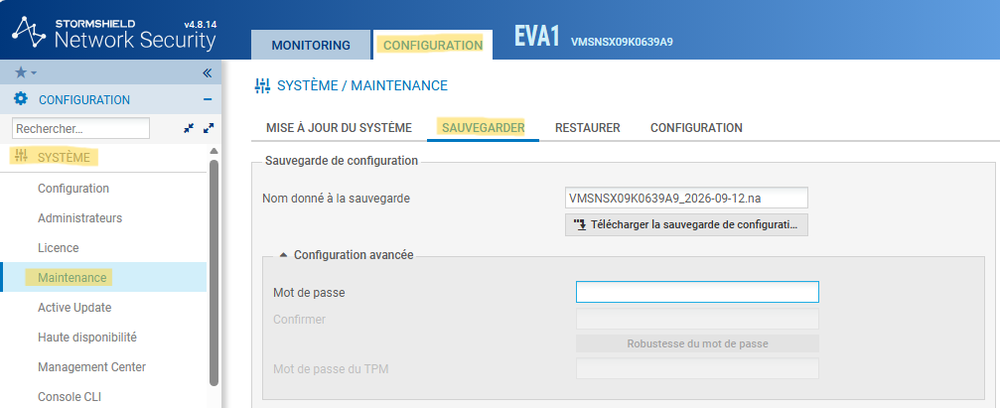

# BLOC 3 - Sauvegarde de la configuration sur Stormshield


<div style="margin-top: 70px; border: 1px solid #ccc; padding: 20px; border-radius: 10px;">
    <p><strong>Auteur :</strong> KADA Amine</p>
    <p><strong>Classe :</strong> BTS SIO 2 - Option SISR</p>
    <p><strong>Date :</strong> 12/09/2026</p>
    <p><strong>Contexte :</strong> Configuration Sauvegarde de la configuration sur Stormshield</p>
</div>

---

## Informations

- **Auteur :** Amine Kada
- **Date :** 12/09/2026
- **Domaine :** Réseau

---

## 1. Sommaire

- [1. Sommaire](#1-sommaire)
- [2. Contexte](#2-contexte)
- [3. Génération de la sauvegarde chiffrée](#3-generation-de-la-sauvegarde-chiffree)
- [4. Archivage dans le dépôt GitHub](#4-archivage-dans-le-depot-github)

## 2. Contexte

Cette procédure décrit les étapes permettant de sauvegarder la configuration d'un pare-feu Stormshield, de la chiffrer avec un mot de passe sécurisé et de l'archiver dans le dépôt documentaire CUB. Cela garantit la reprise d'activité rapide en cas de défaillance de l'équipement matériel, tout en respectant les standards de stockage (Git).

## 3. Génération de la sauvegarde chiffrée {#3-generation-de-la-sauvegarde-chiffree}

3.1. **Accéder au module de sauvegarde.** Dans l'interface d'administration Stormshield, naviguez dans le menu `Système` > `Maintenance`, puis sélectionnez l'onglet `SAUVEGARDER`.



3.2. **Sécuriser la configuration.** Renseignez le mot de passe de protection dans la section `Configuration avancée`.

> [!info] Informations d'identification
> Le mot de passe requis est stocké sur [Bitwarden.eu](https://vault.bitwarden.eu/#/login) sous l'intitulé exact : **dmd-fw-c1 - Pare-feu - Mot de passe backup**.

3.3. **Télécharger l'archive.** Nommez la sauvegarde (ex: par défaut avec la date) et cliquez sur le bouton `Télécharger la sauvegarde de configuration`.

## 4. Archivage dans le dépôt GitHub {#4-archivage-dans-le-depot-github}

4.1. **Renommer et déplacer le fichier.** Renommez l'archive téléchargée en `dmd-fw-c1.na` (ou selon le nom exact de votre équipement) et déplacez-la dans le répertoire local `docs/ressources/configurations/`.

4.2. **Pousser sur le dépôt distant.** Ajoutez le fichier au suivi Git, validez les changements, puis envoyez-les vers le dépôt [GitHub IT-Amine/cub](https://github.com/IT-Amine/cub).

**Commandes Git pour le dépôt :**

```bash
git add docs/ressources/configurations/dmd-fw-c1.na
git commit -m "backup: update stormshield configuration for dmd-fw-c1"
git push origin main
```

- `add` : Ajoute l'archive de configuration modifiée à l'index Git.
- `commit -m` : Crée une révision locale avec un message descriptif de l'action.
- `push` : Synchronise la nouvelle sauvegarde sur le dépôt distant pour la rendre accessible à l'équipe.
