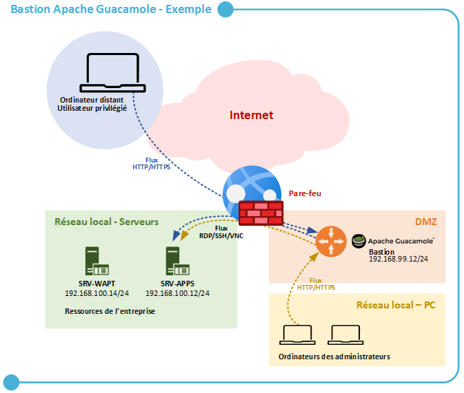

# BLOC 2 - Activité 1 : Réflexion sur le Bastion

    
<strong>Auteur :</strong> KADA Amine

    
<strong>Classe :</strong> BTS SIO 2 - Option SISR

    
<strong>Date :</strong> 30/09/2026

    
<strong>Contexte :</strong> Réflexion théorique sur le positionnement du Bastion

## Sommaire

- [Sommaire](#sommaire)
- [Architecture du Bastion Guacamole](#architecture-du-bastion-guacamole)
- [Partie 1 - Bastion et rupture protocolaire](#partie-1-bastion-et-rupture-protocolaire)
- [Partie 2 - Bastion et son positionnement dans l'architecture réseau](#partie-2-bastion-et-son-positionnement-dans-larchitecture-reseau)

---

## Architecture du Bastion Guacamole

Le schéma ci-dessous illustre le fonctionnement d'Apache Guacamole en tant que Bastion d'administration. Il joue le rôle d'intermédiaire unique et sécurisé (passerelle) entre les administrateurs et les serveurs internes.

## Partie 1 - Bastion et rupture protocolaire

**1. Le bastion met-il en oeuvre une rupture protocolaire complète entre l'utilisateur et les ressources ?**

> Oui. Quand on utilise Guacamole, on se connecte au bastion via un navigateur web classique (en utilisant le protocole HTTPS ou HTTP). Ensuite, c'est le serveur Guacamole lui-même qui initie une toute nouvelle connexion vers le serveur cible avec un protocole différent (comme SSH pour Linux ou RDP pour Windows). Le protocole change donc au milieu, il n'y a pas de lien direct.

**2. Les sessions utilisateur et les sessions vers les cibles sont-elles distinctes et indépendantes ?**

> Oui, elles sont totalement séparées. Il y a une session web entre mon PC et le serveur Guacamole, et une session distincte entre le serveur Guacamole et le serveur cible. Cela apporte une sécurité en plus, car notre machine locale n'est jamais en contact direct avec les serveurs d'infrastructure.

**3. Est-il impossible techniquement d'établir une connexion directe entre l'utilisateur et la ressource ?**

> Dans une architecture bien sécurisée, ça doit être impossible. On doit configurer le pare-feu (comme notre Stormshield) pour bloquer toutes les tentatives de connexion SSH (port 22) ou RDP (port 3389) provenant des PC des administrateurs vers les serveurs. La seule machine autorisée à passer le pare-feu pour joindre les serveurs, c'est le bastion.

**4. Le bastion est-il l'unique point d'entrée pour les accès d'administration ?**

> Oui, c'est tout l'intérêt d'un bastion. Au lieu de laisser des portes d'entrée ouvertes sur tous les serveurs, on bloque tout, et on oblige les techniciens à passer par cet unique sas de sécurité (le bastion) pour administrer le reste du réseau. C'est beaucoup plus facile à surveiller.

---

## Partie 2 - Bastion et son positionnement dans l'architecture réseau

**5. Le bastion est-il isolé dans une zone réseau spécifique ?**

> En principe oui, on le place souvent dans une zone réseau bien isolée comme une DMZ ou un VLAN dédié à l'administration. Cela évite que si un poste utilisateur classique est infecté par un malware, l'attaque puisse se propager facilement jusqu'au bastion.

**6. Les flux réseau entrants et sortants du bastion sont-ils documentés, contrôlés et limités aux protocoles strictement nécessaires ?**

> Oui, les règles de pare-feu doivent être très strictes :
> - **En entrée :** Seul le flux web (port 443 pour le HTTPS) venant du réseau des administrateurs est autorisé.
> - **En sortie :** Le bastion n'a le droit de communiquer qu'avec les serveurs internes cibles, et uniquement sur les ports d'administration (22, 3389). Tout autre flux (vers internet par exemple) doit être bloqué.

**7. Le bastion est-il intégré dans une architecture globale qui assure la traçabilité et la supervision des accès d'administration ?**

> Oui, vu que tout le monde est obligé de passer par Guacamole, ce dernier devient un endroit parfait pour tracer qui fait quoi. Dans les logs de Guacamole, on peut voir qui s'est connecté, à quelle heure, sur quel serveur. On peut même (avec certaines configurations) enregistrer la vidéo des sessions.

**8. Des mesures de continuité et de résilience sont-elles prévues pour garantir les accès critiques en cas d'indisponibilité du bastion ?**

> C'est le point faible du système centralisé : si le bastion tombe en panne, on ne peut plus rien administrer ! Il faut donc prévoir des sauvegardes régulières (snapshots de la VM) ou de la redondance (deux serveurs Guacamole) pour pouvoir vite rétablir le service en cas de crash. On peut aussi garder une porte dérobée ultra-sécurisée (ex: accès direct depuis le port console physique ou une IP de secours) en cas d'urgence absolue.
