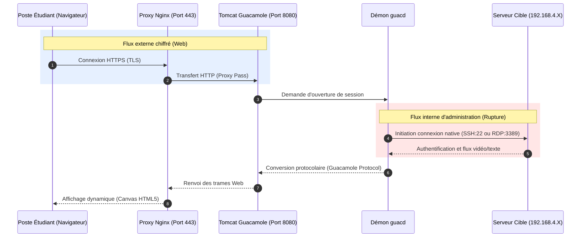

# BLOC 2 - Gestion des utilisateurs et des sessions (Guacamole)

    
<strong>Auteur :</strong> KADA Amine

    
<strong>Classe :</strong> BTS SIO 2 - Option SISR

    
<strong>Date :</strong> 30/09/2026

    
<strong>Contexte :</strong> CUB - Situation 4 - Activité 2 (Configuration du Bastion)

---

## 1. PARTIE 2 : Gestion des utilisateurs

Toutes les configurations suivantes sont réalisées depuis l'interface web de Guacamole en se connectant initialement avec le compte par défaut (`guacadmin`). 

### 1.1. Sécurisation du compte administrateur
Création d'un compte administrateur dédié et suppression du compte par défaut.

1. Naviguer vers **Paramètres** (en haut à droite) > onglet **Utilisateurs** > **Nouvel utilisateur**.
2. Nom d'utilisateur : `adminbastion`.
3. Mot de passe : *Saisir un mot de passe robuste via un gestionnaire dédié*.
4. **Autorisations :** Cocher toutes les cases (Administrer le système, Créer des utilisateurs, etc.) **SAUF** le droit d'audit (`audit system`).
5. Enregistrer, se déconnecter, puis se reconnecter avec `adminbastion`.
6. Retourner dans **Utilisateurs** et **supprimer le compte `guacadmin`** par défaut.

> **Question 4 - Recommandations de l'ANSSI concernant l'audit :**
> Conformément au principe de séparation des privilèges, l'administrateur système du bastion ne doit pas posséder les droits d'audit. Si un administrateur malveillant (ou compromis) dispose de ce droit, il pourrait altérer ou effacer les journaux de connexion et les enregistrements de session pour masquer ses traces. Le rôle d'auditeur doit être strictement confié à une entité tierce (ex: RSSI).

### 1.2. Création des groupes d'utilisateurs
Création de deux groupes distincts pour restreindre les accès par système d'exploitation.

1. Naviguer vers **Paramètres** > onglet **Groupes** > **Nouveau groupe**.
2. **Groupe 1 :** `ServeursLinux`.
   - Autorisations : Cocher uniquement **"Créer de nouvelles connexions"**.
3. **Groupe 2 :** `ServeursWindows`.
   - Autorisations : Cocher uniquement **"Créer de nouvelles connexions"**.

### 1.3. Création des comptes d'administration déléguée
Création des comptes associés aux groupes précédents.

1. Naviguer vers **Paramètres** > onglet **Utilisateurs** > **Nouvel utilisateur**.
2. **Utilisateur 1 :** `adminlinux`.
   - Autorisations : Cocher **"Créer de nouvelles connexions"** et **"Modifier son propre mot de passe"**.
   - Groupes (en bas de page) : Cocher `ServeursLinux`.
3. **Utilisateur 2 :** `adminwindows`.
   - Autorisations : Cocher **"Créer de nouvelles connexions"** et **"Modifier son propre mot de passe"**.
   - Groupes : Cocher `ServeursWindows`.

---

## 2. PARTIE 3 : Gestion des sessions SSH et RDP

### 2.1. Configuration de la session SSH (Serveur Linux)
1. Naviguer vers **Paramètres** > onglet **Connexions** > **Nouvelle connexion**.
2. **Nom :** Serveur Linux SSH
3. **Protocole :** SSH
4. **Réseau :** 
   - Nom d'hôte : `192.168.4.X`
   - Port : `22`
5. **Authentification :** Saisir les identifiants locaux de la machine Linux.
6. **Affectation au groupe :** Dans les paramètres de la connexion (ou du groupe d'utilisateurs), affecter cette connexion au groupe `ServeursLinux`.

> **Vérification (Question 7 & 8) :** 
> En se connectant avec l'utilisateur `adminlinux`, seule la connexion SSH apparaît et lance un rebond valide. En se connectant avec `adminwindows`, la connexion SSH est invisible (accès refusé).

### 2.2. Configuration de la session RDP (ServeurWAC1)
1. Naviguer vers **Paramètres** > onglet **Connexions** > **Nouvelle connexion**.
2. **Nom :** ServeurWAC1 RDP
3. **Protocole :** RDP
4. **Réseau :**
   - Nom d'hôte : `192.168.4.x`
   - Port : `3389`
5. **Authentification :** Saisir les identifiants locaux du Serveur Windows.
6. **Affectation au groupe :** Affecter cette connexion au groupe `ServeursWindows`.
*(Vérifier avec `adminwindows` que la connexion s'ouvre correctement, et qu'elle est invisible pour `adminlinux`).*

---

## 3. Analyse réseau et Rupture Protocolaire

L'observation du trafic réseau via `tcpdump` (sur le serveur Linux) et `Wireshark` (sur le serveur ServeurWAC1) met en évidence le fonctionnement fondamental d'un bastion : **la rupture protocolaire**.

> **Constatation (Questions 9 & 11) :**
> Lors d'une écoute réseau sur le serveur cible, les trames entrantes (TCP/22 pour SSH ou TCP/3389 pour RDP) ont pour adresse IP source **l'adresse IP du bastion Guacamole**, et non l'adresse IP du poste physique de l'étudiant.
>
> **Justification :** Le bastion agit comme un proxy applicatif strict. Il scinde la communication en deux flux totalement isolés. Le poste client ne dialogue avec le bastion qu'en HTTPS (port 443). Le démon interne du bastion (`guacd`) initie lui-même une nouvelle requête vers la cible dans le protocole d'administration natif (SSH/RDP). Il est donc impossible pour un attaquant sur le réseau d'attaquer directement les ports d'administration des serveurs, car seul le bastion est autorisé à s'y connecter.

### Diagramme de Séquence de la Rupture Protocolaire

---

## 4. Traçabilité et Audit

Cette section fait suite à la configuration des accès et vise à garantir la traçabilité complète des actions sur le bastion : journalisation systématique, identification des utilisateurs, enregistrement vidéo des sessions, et intégration de l'authentification multi-facteurs (MFA).

### 4.1. Configuration du compte d'Audit

La séparation des privilèges impose la création d'un compte dédié à la consultation des journaux, sans droits d'administration sur les systèmes.

1. Se connecter au bastion avec le compte administrateur global (`adminbastion`).
2. Naviguer vers **Paramètres** > onglet **Utilisateurs** > **Nouvel utilisateur**.
3. **Nom d'utilisateur :** `Auditeur`.
4. **Mot de passe :** *Saisir un mot de passe robuste via un gestionnaire dédié.*
5. **Autorisations :** Cocher **exclusivement** les droits suivants :
   - **Auditer le système** (Audit system) : pour visualiser l'historique global des connexions et des enregistrements.
   - **Modifier son propre mot de passe**.
6. **Affectation aux connexions :** Dans la section inférieure, cocher les connexions créées précédemment (Serveur Linux SSH et ServeurWAC1 RDP) pour que l'auditeur y soit associé et puisse consulter leurs historiques respectifs.

### 4.2. Historique des connexions

Afin de valider la journalisation, une simulation de connexion est réalisée.

1. **Génération de trafic :** Se connecter au bastion avec le compte `adminlinux` et lancer une session SSH vers le serveur Linux, puis la refermer pour générer une trace.
2. **Audit :** Se connecter avec le nouveau compte `Auditeur`.
3. Naviguer vers **Paramètres** > **Historique**.
4. Filtrer ou rechercher la connexion : l'interface affiche l'utilisateur (`adminlinux`), le nom de la connexion, l'adresse IP source, ainsi que la date et l'heure exactes de début et de fin de la session.

---

## 5. Enregistrement vidéo des sessions (RDP)

La configuration suivante permet d'enregistrer graphiquement les sessions administratives pour repérer d'éventuelles erreurs de manipulation. Lors du déploiement Docker, le volume `./drive` a été monté sur `/drive` dans le conteneur `guacd`.

### 5.1. Configuration de l'enregistrement
1. Se connecter avec `adminbastion`.
2. Naviguer vers **Paramètres** > **Connexions** et sélectionner la connexion pointant vers **ServeurWAC1**.
3. Descendre dans la section **Enregistrement de l'écran** (Screen Recording).
4. **Chemin de l'enregistrement :** Saisir `/drive` (correspondant au volume persistant partagé sur l'hôte Debian).
5. **Nom de l'enregistrement :** Saisir `${GUAC_USERNAME}-${GUAC_DATE}-${GUAC_TIME}` pour nommer dynamiquement le fichier avec les métadonnées de la session.
6. Enregistrer les modifications.

### 5.2. Génération de l'incident et Audit
1. Se connecter en endossant le rôle `adminwindows` et ouvrir la session RDP vers **ServeurWAC1**.
2. Réaliser la désactivation temporaire du pare-feu Windows (l'erreur de manipulation), puis fermer la session sans le réactiver.
3. L'enregistrement vidéo brut est généré automatiquement par le démon `guacd` dans le dossier partagé `/opt/guacamole/drive` du serveur Debian.
4. **Audit :** Le compte `Auditeur` peut retrouver la preuve "en vidéo" de cette erreur commise par `adminwindows`. *(Note technique : la lecture des fichiers graphiques bruts générés par Guacamole s'effectue généralement à l'aide de l'utilitaire `guacenc` permettant de les convertir au format vidéo standard `.m4v` / `.mp4`).*
