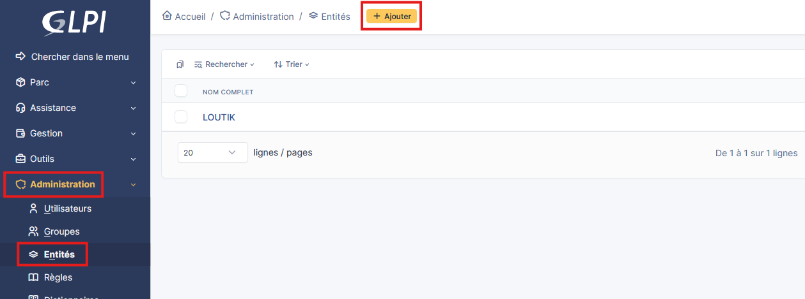
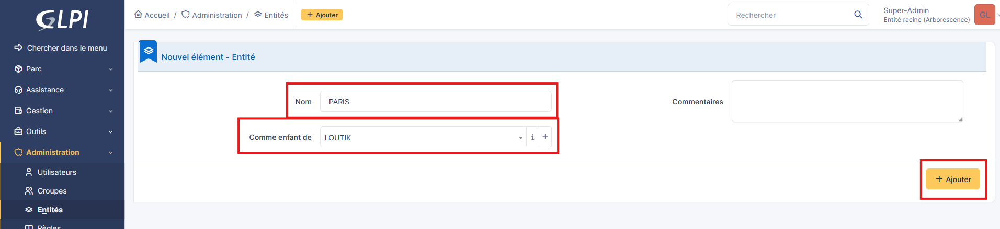

# Création et gestion des entités GLPI


---

## Informations

- **Auteur :** KADA Amine
- **Date :** 26/09/2026
- **Domaine :** Exploitation services

---

## 1. Sommaire

- [2. Contexte : Architecture multi-tenant et isolation](#2-contexte)
- [3. Création de l'entité via API REST](#3-creation-de-lentite-via-api-rest)
- [4. Création de l'entité via l'Interface Web (IHM)](#4-creation-de-lentite-via-linterface-web-ihm)

## 2. Contexte {#2-contexte}

Dans GLPI, une **entité** est une unité organisationnelle permettant de segmenter et de compartimenter les données (concept de Multi-tenancy). Ce mécanisme est crucial pour isoler les parcs informatiques, les utilisateurs et les tickets d'assistance entre différents clients, filiales ou départements.

**Fonctionnement vis-à-vis des objets de l'infrastructure :**

- **Isolation logique :** Un objet (ordinateur, contrat, ticket, document) appartient obligatoirement à une entité. Les utilisateurs restreints à l'`Entité A` n'ont aucune visibilité, ni droit d'interaction sur les objets de l'`Entité B`.
- **Arborescence et Héritage :** Les entités fonctionnent sous forme d'arbre (Racine > Enfant). Un administrateur possédant un profil sur l'entité "Racine" avec le drapeau "Récursif" (Sous-entités : Oui) dispose d'une visibilité descendante sur l'ensemble des objets des entités filles.
- **Interactions transverses :** Pour lier un matériel d'une entité à un utilisateur d'une autre entité, le système exige une gestion précise des habilitations depuis une entité parente commune. L'injection d'inventaires (via GLPI Agent) est également directement routée vers des entités spécifiques grâce à des règles basées sur des tags ou des sous-réseaux.

> [!warning] Conception de l'arborescence
> Une arborescence mal pensée dès l'initialisation du projet (ex: absence d'entité racine fédératrice ou arborescence trop profonde) entraînera des migrations de données complexes et des failles de cloisonnement. Il est recommandé de mapper la structure selon les besoins de refacturation ou d'isolation réseau.

## 3. Création de l'entité via API REST {#3-creation-de-lentite-via-api-rest}

3.1.  **Génération de l'entité.** Création d'une sous-entité en utilisant le client d'API. Cette méthode garantit l'idempotence et permet l'intégration du provisionnement GLPI dans des pipelines d'automatisation.

```bash
curl -X POST "https://glpi.yourdomain.lan/apirest.php/Entity" \
        -H "Content-Type: application/json" \
        -H "App-Token: v0tr3_app_t0k3n_s3cr3t" \
        -H "Session-Token: v0tr3_s3ssi0n_t0k3n" \
        -d '{"input": {"name": "Filiale_Bordeaux", "entities_id": 0, "comment": "Entité isolée pour le réseau VLAN 40"}}'
```

- `App-Token` : Jeton de sécurité statique identifiant l'application cliente autorisée à interagir avec l'API GLPI.
- `Session-Token` : Jeton dynamique éphémère obtenu après authentification d'un compte super-admin.
- `name` : Déclare la chaîne de caractères du nom de la nouvelle entité.
- `entities_id` : Définit l'ID de l'entité parente (`0` correspond obligatoirement à l'entité racine `Root entity`).

## 4. Création de l'entité via l'Interface Web (IHM) {#4-creation-de-lentite-via-linterface-web-ihm}

4.1.  **Accès au module d'administration.** Navigation dans l'interface de gestion structurelle pour configurer la compartimentation manuellement.

```text
Menu de navigation : Administration > Entités > Bouton "Ajouter"
```

- `Administration` : Catégorie regroupant les paramètres globaux d'infrastructure et les profils.
- `Entités` : Module dédié à la création et l'édition de l'arbre organisationnel.



4.2. **Configuration des propriétés de base.** Renseignement des métadonnées permettant d'identifier l'entité dans l'arbre d'héritage.

```text
Nom : PARIS
Entité parente : LOUTIK
```

- `Nom` : Nom d'affichage qui sera visible dans le sélecteur d'entité en haut à droite de l'écran pour les utilisateurs.
- `Entité parente` : Détermine l'emplacement de rattachement dans l'arbre, impactant directement la propagation des profils récursifs.


