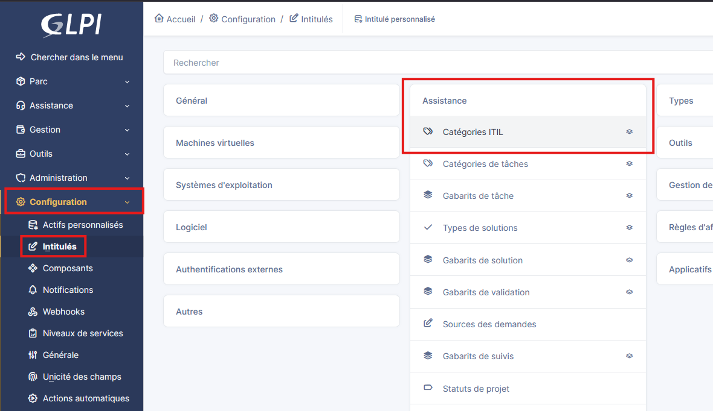

# Création des catégories ITIL sur GLPI


!!! abstract "Informations sur le document"
    - **Auteur :** KADA Amine
    - **Classe :** BTS SIO 2 - Option SISR
    - **Date :** 26/09/2026
    - **Sujet :** Création des catégories ITIL sur GLPI

---

## Contexte

ITIL (Information Technology Infrastructure Library) est un référentiel mondial regroupant les bonnes pratiques du management du système d'information (ITSM). Il standardise les processus d'assistance pour aligner les services IT sur les besoins de l'entreprise.

Dans GLPI, les **catégories ITIL** permettent de classifier structurellement les sollicitations du centre de services (Helpdesk). Elles séparent de manière fondamentale les interruptions de service (Incidents) des demandes de nouveaux services (Demandes). Une arborescence bien définie est indispensable en ingénierie SRE pour automatiser le routage vers les bons groupes de résolution, appliquer les SLA dynamiquement et fiabiliser la métrologie.

> [!info] Terminologie ITIL (Incident vs Demande)
>
> - **Incident :** Une interruption non planifiée ou une dégradation de la qualité d'un service IT (ex: "Le serveur Web ne répond plus").
> - **Demande de service :** Une demande formelle de la part d'un utilisateur pour fournir quelque chose (ex: "Demande d'accès au dossier partagé", "Création d'une VM").

## Création d'une catégorie via API REST (CLI) {#3-creation-dune-categorie-via-api-rest-cli}

3.1. **Création programmatique.** Injection d'une nouvelle catégorie racine "Infrastructure" via l'API, facilitant l'automatisation (IaC).

```bash title="create_itil_category.sh" hl_lines="6"
curl -X POST "https://glpi.yourdomain.lan/apirest.php/ITILCategory" \
        -H "Content-Type: application/json" \
        -H "App-Token: v0tr3_app_t0k3n_s3cr3t" \
        -H "Session-Token: v0tr3_s3ssi0n_t0k3n" \
        -d '{"input": {"name": "Infrastructure", "itilcategories_id": 0, "is_incident": 1, "is_request": 0}}'
```

* `curl` : Outil en ligne de commande pour transférer des données via des protocoles réseau (ici HTTPS).
* `-X POST` : Spécifie la méthode HTTP POST pour ordonner la création d'une ressource sur le serveur.
* `name` : Définit le nom de la catégorie (ici "Infrastructure").
* `itilcategories_id` : ID de la catégorie parente (`0` indique qu'il s'agit d'une catégorie racine).
* `is_incident` / `is_request` : Drapeaux booléens. Ici `1` pour incident et `0` pour demande, restreignant l'usage de cette catégorie aux incidents uniquement.

## Création d'une catégorie via l'Interface Web (IHM) {#4-creation-dune-categorie-via-linterface-web-ihm}

4.1. **Accès au dictionnaire ITIL.** Navigation vers les intitulés pour structurer l'arbre de classification.

```text
Menu de navigation : Configuration > Intitulés > Assistance > Catégories ITIL > Bouton "Ajouter"
```

* `Configuration` : Regroupe les paramètres structurels du comportement de GLPI.
* `Intitulés` : Module gérant les listes déroulantes, nomenclatures et dictionnaires de l'application.



4.2. **Déclaration des attributs.** Saisie des caractéristiques de classification.

```text
Nom : Réseau
Comme enfant de : Infrastructure
Visible pour un incidents : Oui
Visible pour une demandes : Oui
Sous-entités : coché
```

* `Nom` : L'intitulé de la catégorie qui sera affiché aux utilisateurs et techniciens.
* `Comme enfant de` : Permet de créer l'arborescence (ex: Infrastructure > Réseau).
* `Sous-entités` : Permet aux entités enfants de pouvoir utiliser cette catégorie.
