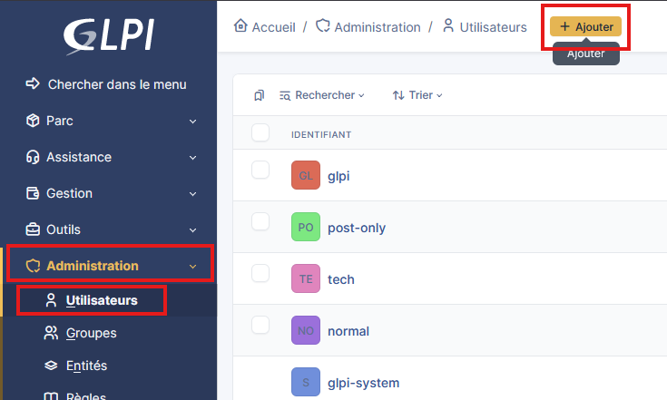
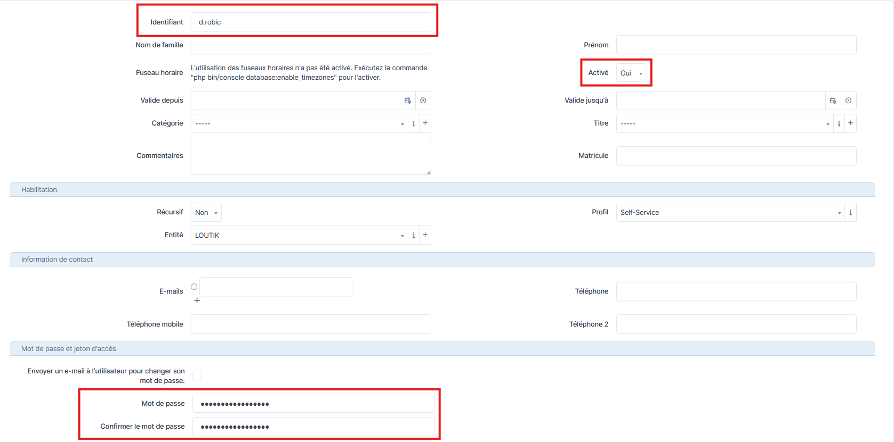
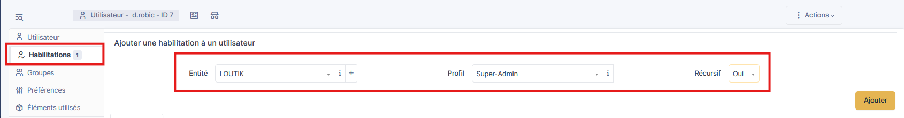

# Créer un utilisateur sur GLPI


---

## Informations

- **Auteur :** KADA Amine
- **Date :** 26/09/2026
- **Domaine :** Exploitation services

---

## 1. Sommaire

- [2. Contexte](#2-contexte)
- [3. Création de l'utilisateur via API REST (CLI)](#3-creation-de-lutilisateur-via-api-rest-cli)
- [4. Création de l'utilisateur via l'Interface Web (IHM)](#4-creation-de-lutilisateur-via-linterface-web-ihm)
- [5. Affectation des profils et entités (RBAC)](#5-affectation-des-profils-et-entites-rbac)

## 2. Contexte

Dans GLPI, un compte utilisateur représente une identité physique ou un compte de service. L'architecture de sécurité de GLPI repose sur le modèle RBAC (Role-Based Access Control). La création du compte dans la base de données ne donne par défaut aucun droit. Le véritable contrôle d'accès s'effectue lors de l'association stricte d'un **Profil** (qui définit les permissions : les actions autorisées) sur une **Entité** (qui définit le périmètre : l'espace cloisonné où les actions sont autorisées).

> [!tip] Bonne pratique
> Dans une infrastructure de production, la création locale et manuelle de comptes doit être évitée. L'approche standard consiste à déléguer l'authentification et le provisionnement (JIT) à un annuaire d'entreprise (Active Directory, OpenLDAP, ou Authentik). La création locale illustrée ci-dessous est réservée aux comptes de service (API) ou aux administrateurs de secours.

## 3. 3. Création de l'utilisateur via API REST (CLI) {#3-creation-de-lutilisateur-via-api-rest-cli}

3.1. **Génération de l'identité.** Provisionnement d'un compte de service via le client d'API, méthode privilégiée pour l'intégration dans des pipelines d'infrastructure as code.

```bash
curl -X POST "https://glpi.yourdomain.lan/apirest.php/Entity" \
        -H "Content-Type: application/json" \
        -H "App-Token: v0tr3_app_t0k3n_s3cr3t" \
        -H "Session-Token: v0tr3_s3ssi0n_t0k3n" \
        -d '{"input": {"name": "svc_monitoring", "password": "StrongPassword123!", "is_active": 1}}'
```

- `name` : Identifiant de connexion (login) de l'utilisateur requis pour l'authentification.
- `password` : Mot de passe local. Il sera haché automatiquement par GLPI en base de données.
- `is_active` : Drapeau booléen d'activation du compte (`1` = Actif, `0` = Désactivé).

## 4. Création de l'utilisateur via l'Interface Web (IHM) {#4-creation-de-lutilisateur-via-linterface-web-ihm}

4.1. **Accès au gestionnaire des identités.** Navigation vers le répertoire consolidant les utilisateurs locaux et synchronisés.

```text
Menu de navigation : Administration > Utilisateurs > Bouton "Ajouter"
```

- `Administration` : Regroupe la configuration globale du système et la gestion de l'IAM (Identity and Access Management).
- `Utilisateurs` : Interface listant les identités et permettant les opérations CRUD (Create, Read, Update, Delete).



4.2. **Déclaration des attributs du compte.** Saisie des informations fondamentales pour instancier l'utilisateur dans l'application.

```text
Identifiant : d.robic
Mot de passe : [Généré aléatoirement et stocké dans un vault]
Actif : Oui
```

- `Identifiant` : Le login de l'utilisateur (convention de nommage standardisée type `p.nom`).
- `Actif` : Option permettant de désactiver l'accès au portail (lors de l'offboarding par exemple) tout en conservant l'intégrité de l'historique des tickets associés à l'utilisateur.



## 5. Affectation des profils et entités (RBAC) {#5-affectation-des-profils-et-entites-rbac}

5.1. **Délégation des privilèges.** Sans cette étape, l'utilisateur recevra une erreur fatale d'autorisation lors de sa tentative de connexion.

```text
Fiche de l'utilisateur > Onglet "Habilitations" > Bouton "Ajouter une habilitation"
Entité : LOUTIK
Profil : Super-Admin
Recursif : Oui
```

- `Entité` : Restreint le périmètre opérationnel (l'axe "Où").
- `Profil` : Attribue le niveau de droits (l'axe "Quoi"). Exemples typiques : `Super-Admin` (bypass global), `Technician` (gestion du parc et résolution ITSM), `Self-Service` (portail restreint pour les déclarations d'incidents).
- `Recursif` : Active l'héritage récursif. Si "Oui", les droits s'appliquent en cascade aux entités enfants selon l'arborescence définie.


