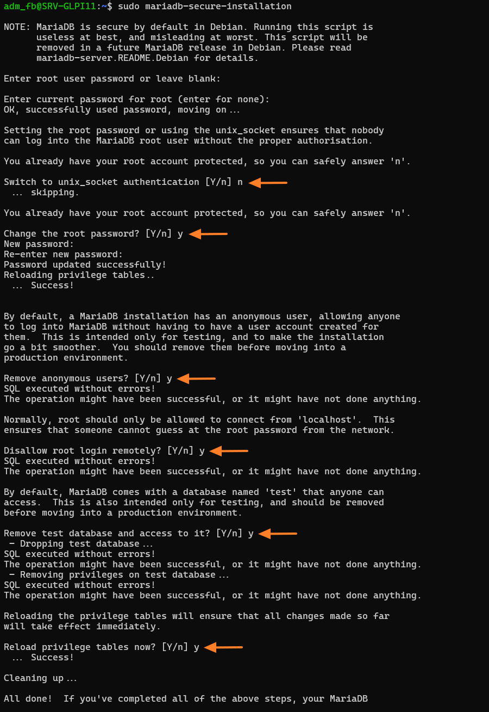
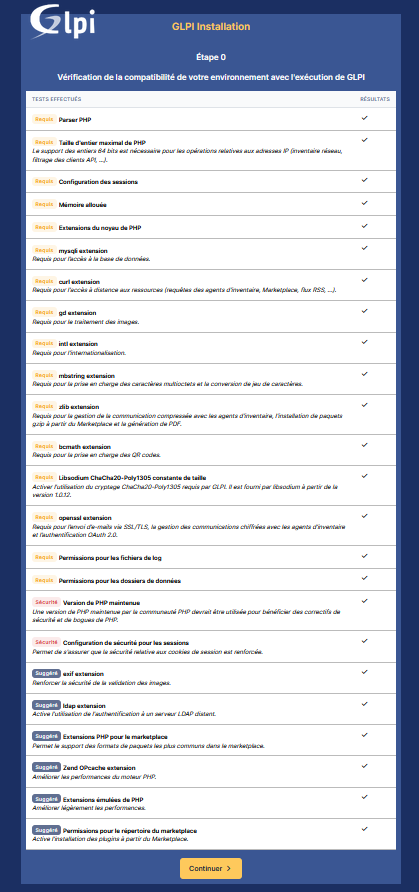
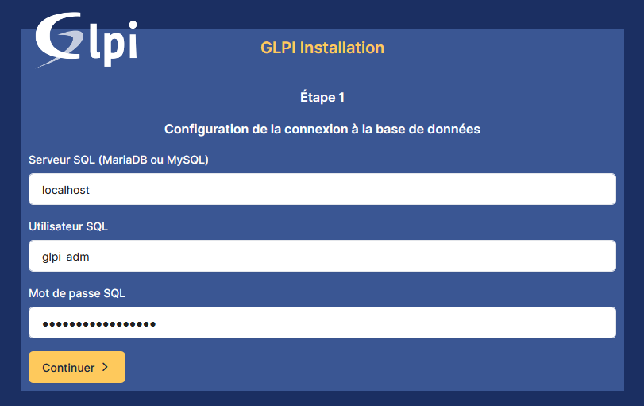
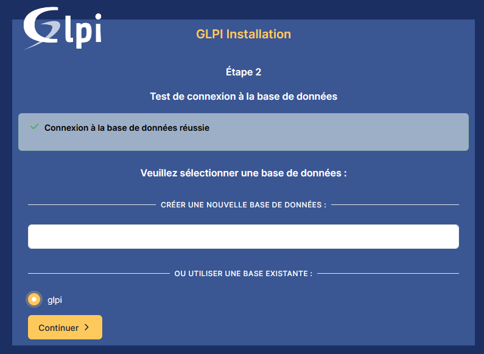
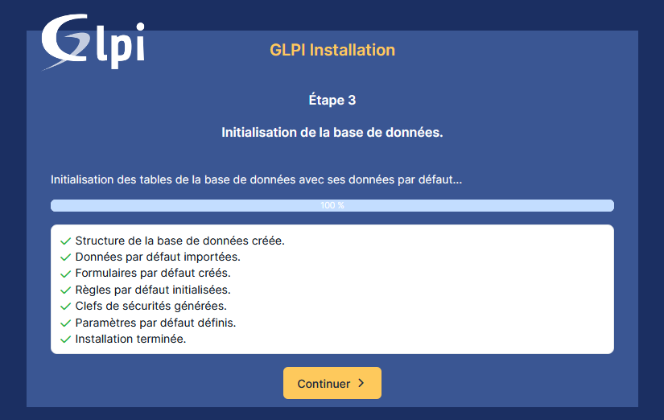

# Installation de GLPI


---

## Informations

- **Auteur :** KADA Amine
- **Date :** 26/09/2026
- **Domaine :** Exploitation services

---

## 1. Sommaire

- [2. Contexte](#2-contexte)
- [3. Préparation du serveur et installation du socle LAMP](#3-preparation-du-serveur-et-installation-du-socle-lamp)
- [4. Préparation de la base de données](#4-preparation-de-la-base-de-donnees)
- [5. Téléchargement et préparation de GLPI](#5-telechargement-et-preparation-de-glpi)
- [6. Configuration Apache2 et PHP-FPM](#6-configuration-apache2-et-php-fpm)
- [7. Installation Web de GLPI](#7-installation-web-de-glpi)

## 2. Contexte

Cette procédure décrit l'installation pas-à-pas de GLPI 11 sur une machine Debian 13. L'installation s'appuie sur une pile LAMP : Linux, Apache2, PHP 8.4 (PHP-FPM) et MariaDB Server. GLPI est un logiciel libre de gestion de parc informatique offrant une solution de ticketing, la gestion de l'inventaire, des contrats, des licences et du matériel.

> [!info] Prérequis de GLPI
> La version minimale de PHP requise est PHP 8.2 (la version 8.4 est installée par défaut sous Debian 13). La base de données nécessite au minimum MySQL 8.0 ou MariaDB 10.6.

## 3. Préparation du serveur et installation du socle LAMP {#3-preparation-du-serveur-et-installation-du-socle-lamp}

3.1. **Mise à jour du système.** Mise à jour de la liste des paquets et application des mises à jour sur Debian 13.

```bash
sudo apt update && sudo apt upgrade
```

- `update` : Récupère la liste des dernières mises à jour disponibles sur les dépôts.
- `upgrade` : Installe automatiquement les nouvelles versions des paquets installés.

3.2. **Installation des paquets principaux.** Installation du serveur web Apache2, du moteur PHP-FPM et du serveur de base de données MariaDB. Le choix de PHP-FPM est privilégié pour des raisons de performance.

```bash
sudo apt install apache2 php8.4-fpm mariadb-server
```

- `apache2` : Installe le serveur Web.
- `php8.4-fpm` : Installe le service PHP autonome (FastCGI).
- `mariadb-server` : Installe le serveur de base de données.

3.3. **Installation des extensions PHP.** Installation des extensions PHP requises pour le bon fonctionnement de GLPI 11.

```bash
sudo apt install php8.4-{curl,gd,intl,mysql,zip,bcmath,mbstring,xml,bz2,ldap}
```

- `curl` : Permet l'accès aux ressources distantes (Marketplace, etc.).
- `gd` : Permet la manipulation et la génération d'images.
- `intl` : Fournit les fonctions d'internationalisation.
- `mysql` : Gère la connexion avec la base MariaDB.
- `zip`, `bz2` : Nécessaire pour la compression (Marketplace).
- `bcmath`, `mbstring`, `xml` : Indispensables pour les QR codes, l'UTF-8 et le traitement XML.
- `ldap` : Extension recommandée pour s'interfacer avec un annuaire Active Directory.

## 4. Préparation de la base de données {#4-preparation-de-la-base-de-donnees}

4.1. **Sécurisation de l'instance MariaDB.** Lancement de l'assistant pour appliquer les configurations de sécurité de base.

```bash
sudo mariadb-secure-installation
```

**Exemple de configuration (crédit : [it-connect.fr](https://www.it-connect.fr/installation-pas-a-pas-de-glpi-10-sur-debian-12/)) :**



- `mariadb-secure-installation` : Script interactif permettant de changer le mot de passe root, supprimer les utilisateurs anonymes et désactiver l'accès root à distance.

4.2. **Création de la base et de l'utilisateur.** Application du principe de moindre privilège en créant une base de données dédiée et un utilisateur restreint pour GLPI.

```bash
# Connectez-vous à MariaDB en rentrant le mot de passe que vous avez défini juste avant.
sudo mysql -u root -p
```

```sql
CREATE DATABASE glpi;
GRANT ALL PRIVILEGES ON glpi.* TO glpi_adm@localhost IDENTIFIED BY "MotDePasseRobuste";
FLUSH PRIVILEGES;
EXIT
```

- `CREATE DATABASE` : Crée la nouvelle base `glpi`.
- `GRANT ALL PRIVILEGES` : Attribue tous les droits sur cette base à l'utilisateur `glpi_adm` avec authentification locale.
- `FLUSH PRIVILEGES` : Force la prise en compte immédiate des nouveaux privilèges en mémoire.

## 5. Téléchargement et préparation de GLPI {#5-telechargement-et-preparation-de-glpi}

5.1. **Téléchargement de l'archive GLPI.** Récupération des sources d'installation depuis le GitHub officiel (version 11.0.4).

```bash
cd /tmp
wget https://github.com/glpi-project/glpi/releases/download/11.0.4/glpi-11.0.4.tgz
```

- `cd /tmp` : Se positionne dans le répertoire des fichiers temporaires.
- `wget` : Télécharge le paquet `.tgz` de GLPI directement depuis l'URL fournie.

5.2.  **Extraction et application des droits Web.** Décompression de l'archive dans le répertoire racine du serveur Web et modification des permissions.

```bash
sudo tar -xzvf glpi-11.0.4.tgz -C /var/www/
sudo chown www-data /var/www/glpi/ -R
```

- `tar -xzvf` : Extrait et décompresse l'archive en affichant les fichiers.
- `-C` : Définit `/var/www/` comme dossier de destination pour l'extraction.
- `chown -R` : Assigne l'utilisateur `www-data` (Apache) de manière récursive sur tous les dossiers GLPI.

5.3. **Sécurisation de l'arborescence.** Déplacement des données sensibles hors du répertoire Web public pour respecter les bonnes pratiques de sécurité.

```bash
sudo mkdir /etc/glpi /var/lib/glpi /var/log/glpi
sudo chown www-data /etc/glpi/ /var/lib/glpi/ /var/log/glpi/
sudo mv /var/www/glpi/config /etc/glpi
sudo mv /var/www/glpi/files /var/lib/glpi
```

- `mkdir` : Crée des dossiers isolés pour la configuration, les données (`files`) et les logs.
- `mv` : Déplace les répertoires originaux de `/var/www/glpi/` vers leurs nouveaux emplacements sécurisés.

5.4. **Déclaration des nouveaux chemins.** Création des fichiers PHP indiquant à GLPI où récupérer ses données délocalisées.

```bash
sudoedit /var/www/glpi/inc/downstream.php
```

```php
<?php
define('GLPI_CONFIG_DIR', '/etc/glpi/');
if (file_exists(GLPI_CONFIG_DIR . '/local_define.php')) {
    require_once GLPI_CONFIG_DIR . '/local_define.php';
}
```

- `define` : Configure la constante `GLPI_CONFIG_DIR` pointant sur le dossier sécurisé `/etc/glpi/`.

```bash
sudoedit /etc/glpi/local_define.php
```

```php
<?php
define('GLPI_VAR_DIR', '/var/lib/glpi/files');
define('GLPI_LOG_DIR', '/var/log/glpi');
```

- `define` : Configure les variables pour définir les emplacements personnalisés pour les fichiers et les journaux (logs).

## 6. Configuration Apache2 et PHP-FPM

6.1. **Création du VirtualHost.** Configuration du site Apache2 dédié pour GLPI.

```bash
sudoedit /etc/apache2/sites-available/glpi.conf
```

```conf
<VirtualHost *:80>
    ServerName glpi.yourdomain.lan
    DocumentRoot /var/www/glpi/public

    <Directory /var/www/glpi/public>
        Require all granted
        RewriteEngine On
        RewriteCond %{HTTP:Authorization} ^(.+)$
        RewriteRule .* - [E=HTTP_AUTHORIZATION:%{HTTP:Authorization}]
        RewriteCond %{REQUEST_FILENAME} !-f
        RewriteRule ^(.*)$ index.php [QSA,L]
    </Directory>

    <FilesMatch \.php$>
        SetHandler "proxy:unix:/run/php/php8.4-fpm.sock|fcgi://localhost/"
    </FilesMatch>
</VirtualHost>
```

- `ServerName` : Indique le nom de domaine (ici `glpi.yourdomain.lan`) utilisé pour accéder à GLPI.
- `DocumentRoot` : Cible directement le dossier `public` pour protéger les autres dossiers GLPI.
- `RewriteEngine` : Active les règles de réécriture utiles pour les API et le routeur.
- `SetHandler` : Transfère l'exécution du code PHP au module PHP-FPM via son socket.

6.2. **Activation des modules et du site.** Déclaration de la configuration sur le serveur Web et activation des dépendances.

```bash
sudo a2ensite glpi.conf
sudo a2dissite 000-default.conf
sudo a2enmod rewrite proxy_fcgi setenvif
sudo a2enconf php8.4-fpm
```

- `a2ensite` : Active le fichier de configuration du VirtualHost fraîchement créé.
- `a2dissite` : Désactive la page web par défaut d'Apache.
- `a2enmod` / `a2enconf` : Active les modules de réécriture, le reverse proxy FastCGI et la configuration PHP-FPM.

6.3. **Sécurisation des cookies de session PHP.** Modification des variables `php.ini` pour renforcer la protection des sessions utilisateurs.

```bash
sudoedit /etc/php/8.4/fpm/php.ini
```

```ini
; /etc/php/8.4/fpm/php.ini
session.cookie_httponly = on
; ...
; Mitigation Cross-Site Request Forgery (CSRF/XSRF)
session.cookie_samesite = Lax
```

- `cookie_httponly` : Rend les cookies inaccessibles aux langages scripts comme JavaScript.
- `cookie_samesite` : Limite la transmission des cookies par le navigateur pour contrer les attaques CSRF.

6.4. **Application de la configuration.** Redémarrage des services pour valider les paramètres.

```bash
sudo systemctl restart php8.4-fpm.service
sudo systemctl restart apache2
```

- `systemctl restart` : Relance les processus système pour qu'ils prennent en compte les modifications.

## 7. Installation Web de GLPI

7.1.  **Lancement de l'assistant de configuration.** Accès au portail d'installation via l'URL définie (`glpi.yourdomain.lan`).


7.2.  **Vérification de la compatibilité.** Validation des prérequis techniques (extensions PHP, paramètres, etc.) par l'installateur intégré.



7.3.  **Connexion à MariaDB.** Saisie des identifiants (Serveur: `localhost`, Utilisateur: `glpi_adm`, Mot de passe SQL) et sélection de la base `glpi`.

**Étape 1 :**



**Étape 2 :**



7.4.  **Initialisation de la base de données.** Création automatique de la structure (tables) et de la clé de sécurité.



> [!danger] Comptes par défaut à modifier
> Une fois connecté sur le tableau de bord, vous devez impérativement changer les mots de passe pour les comptes d'origine :
> 
> - `glpi` / `glpi` (Super-Admin)
> - `tech` / `tech` (Technicien)
> - `normal` / `normal` (Utilisateur standard)
> - `post-only` / `postonly` (Création ticket)

7.5.  **Suppression du script d'installation.** Mesure post-installation obligatoire pour éviter l'écrasement ou le piratage du système.

```bash
sudo rm /var/www/glpi/install/install.php
```

- `rm` : Supprime physiquement le fichier d'installation Web pour clore définitivement le processus de déploiement.
