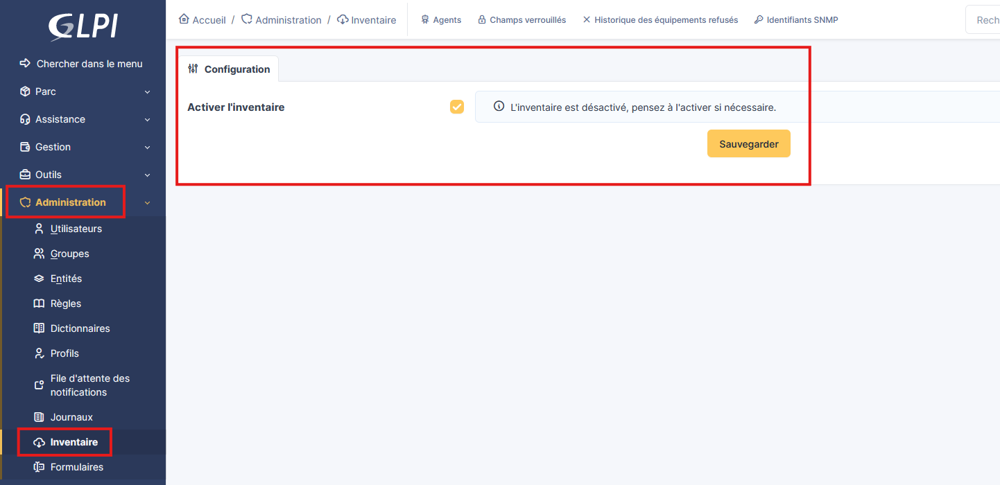
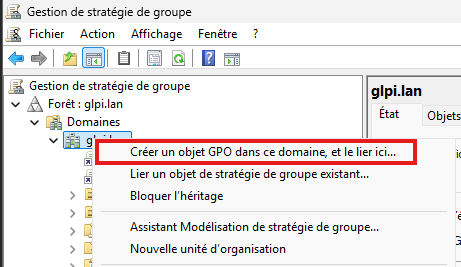
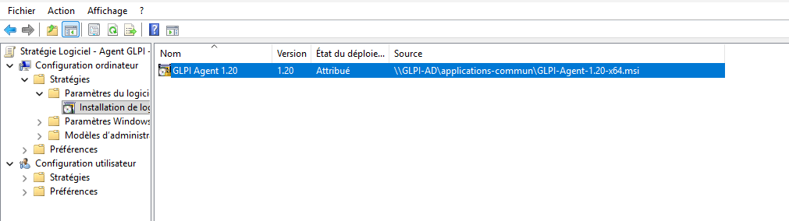
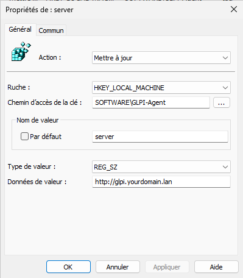
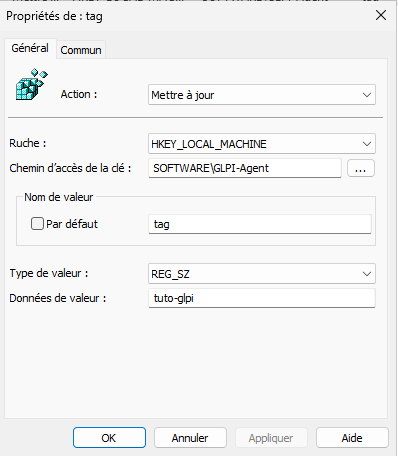
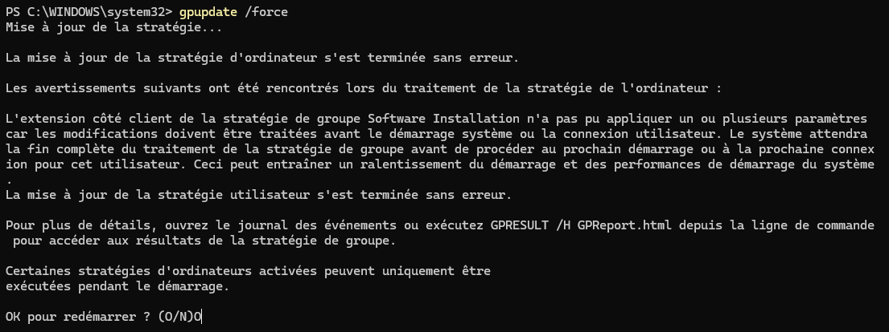
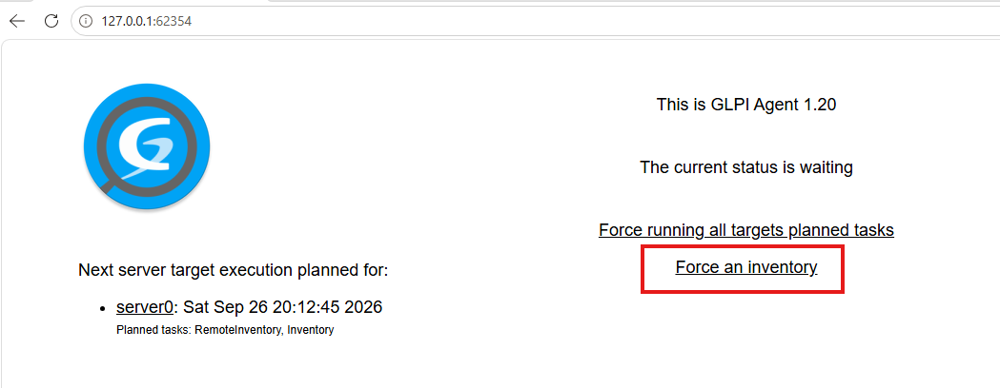
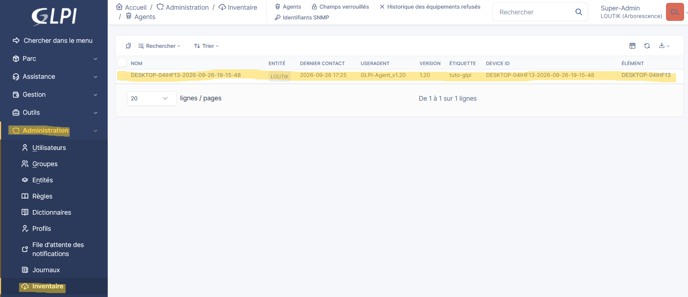
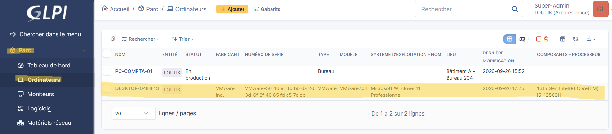

# Mise en place de l'inventaire automatisé sur GLPI


!!! abstract "Informations sur le document"
    - **Auteur :** KADA Amine
    - **Classe :** BTS SIO 2 - Option SISR
    - **Date :** 26/09/2026
    - **Sujet :** Mise en place de l'inventaire automatisé sur GLPI

---

## Contexte : L'agent GLPI {#2-contexte-lagent-glpi}

L'agent GLPI est basé sur l'agent open source FusionInventory. Il permet d'inventorier automatiquement les équipements (ordinateurs, smartphones, tablettes) pour remonter les informations matérielles et logicielles dans GLPI. L'agent est compatible avec plusieurs OS, incluant Windows (32 et 64 bits), macOS, Linux et Android. Cette procédure détaille le déploiement sur Windows via GPO (Group Policy Object).

## Activation de l'inventaire dans GLPI {#3-activation-de-linventaire-dans-glpi}

3.1. **Activer la fonctionnalité.** Contrairement aux versions précédentes nécessitant un plugin, la fonction d'inventaire est native dans GLPI 10 mais désactivée par défaut.

```text
Menu de navigation : Administration > Inventaire > Cocher "Activer l'inventaire" > Sauvegarder
```

* `Administration` : Menu latéral pour les paramètres globaux.
* `Inventaire` : Section dédiée à la configuration de la remontée d'informations.
* `Activer l'inventaire` : Option à cocher pour autoriser GLPI à recevoir les données des agents.



## Création de la GPO pour déployer l'agent GLPI {#4-creation-de-la-gpo-pour-deployer-lagent-glpi}

4.1. **Préparation du package d'installation.** Téléchargez le package MSI de l'agent GLPI depuis le GitHub officiel et placez-le sur un partage réseau accessible en lecture par les "Ordinateurs du domaine".

- [Github release - GLPI Agent](https://github.com/glpi-project/glpi-agent/releases)
- [Procédure de création d'un partage réseau sur Windows Serveur](https://www.it-connect.fr/windows-server-2022-creer-son-premier-partage-de-fichiers-smb/)

4.2. **Création et liaison de la GPO.** Dans la console "Gestion de stratégie de groupe", créez une GPO nommée "Logiciel - Agent GLPI - Installer" et liez-la à l'Unité d'Organisation (OU) contenant les postes cibles.



> [!info] Informations
> Si vous créez la GPO directement à la racine du domaine, l'agent GLPI sera installé sur toutes les machines du domaine (serveurs et ordinateurs).

4.3. **Configuration du déploiement logiciel.** Paramétrez l'installation du package MSI via la GPO. Pour ouvrir la configuration de la GPO, faites un clic droit, puis **Modifier**.

```text
Chemin GPO : Configuration ordinateur > Stratégies > Paramètres du logiciel > Installation de logiciel
Action : Clic droit > Nouveau > Package
Chemin : Chemin de votre partage SMB : Ex. \\GLPI-AD\applications-commun\...
Type de déploiement : Attribué
```

- `Installation de logiciel` : Permet de forcer l'installation du package MSI au démarrage du poste.
- `Attribué` : L'installation se fera automatiquement.



4.4. **Configuration de l'agent via le Registre.** Configurez les paramètres de l'agent GLPI en définissant des clés de registre via la GPO.

```text
Chemin GPO : Configuration ordinateur > Préférences > Paramètres Windows > Registre
Action : Clic droit > Nouveau > Élément Registre
```

**Valeur 1 : Serveur GLPI**

- `Action` : Mettre à jour
- `Ruche` : HKEY_LOCAL_MACHINE
- `Chemin d'accès de la clé` : SOFTWARE\GLPI-Agent
- `Nom de valeur` : server
- `Type de valeur` : REG_SZ
- `Données de valeur` : [L'URL de votre serveur, ex: https://glpi.yourdomain.lan]



**Valeur 2 : Tag (Optionnel)**

- `Action` : Mettre à jour
- `Ruche` : HKEY_LOCAL_MACHINE
- `Chemin d'accès de la clé` : SOFTWARE\GLPI-Agent
- `Nom de valeur` : tag
- `Type de valeur` : REG_SZ
- `Données de valeur` : [Votre tag, ex: client ou serveur]



## Test et validation {#5-test-et-validation}

5.1. **Application de la GPO sur un poste.** Sur un poste de travail membre de l'OU ciblée, forcez la mise à jour des stratégies.

```cmd
gpupdate /force
```

**Résultat du `gpupdate /force` :**



- Après le redémarrage, vérifiez que "GLPI Agent" est présent dans la liste des applications installées.

5.2. **Forcer l'inventaire manuellement.** Par défaut, l'inventaire ne se lance pas immédiatement (il faut patienter environ 1 heure). Pour tester, accédez à l'interface locale de l'agent.

```text
URL locale : http://127.0.0.1:62354
Action : Cliquer sur "Force an inventory"
```



- L'interface locale permet de déclencher la remontée d'informations vers le serveur GLPI.

5.3. **Vérification dans GLPI.** Vérifiez que l'agent et la machine sont bien remontés dans l'interface GLPI.

```text
Vérification de l'agent : Administration > Inventaire > Agents
Vérification de l'équipement : Parc > Ordinateurs
```




