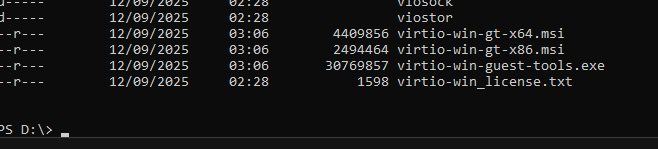
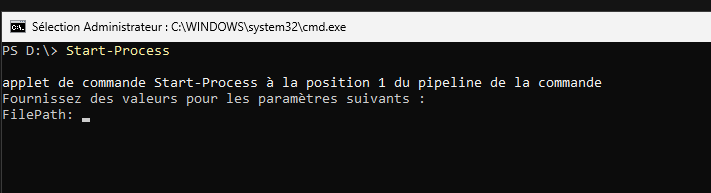
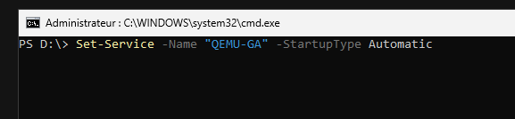
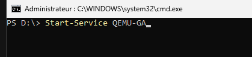
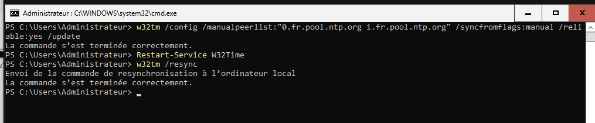
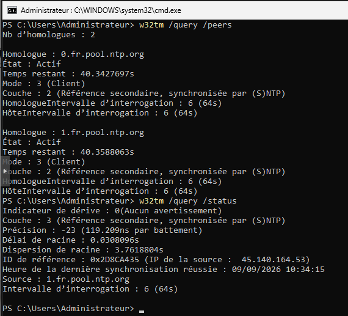
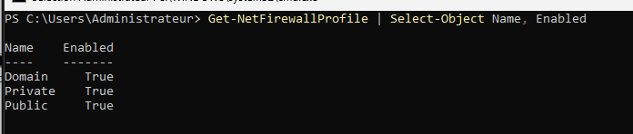
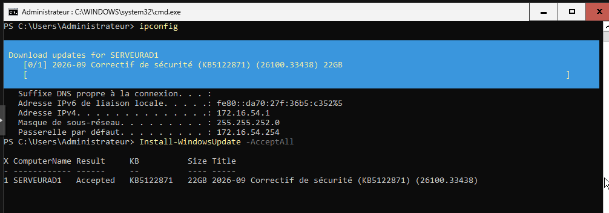
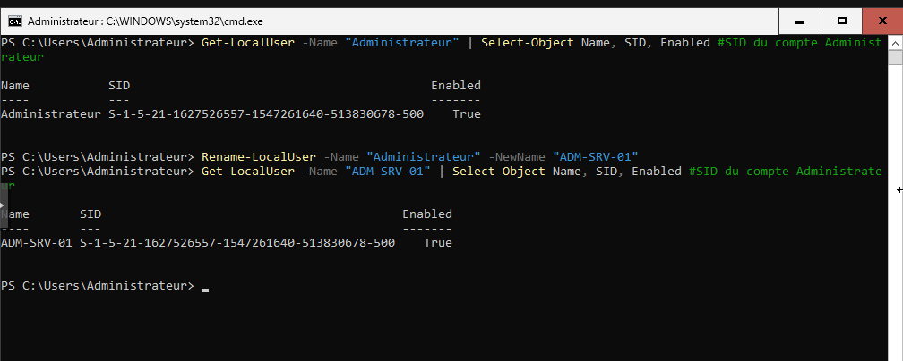
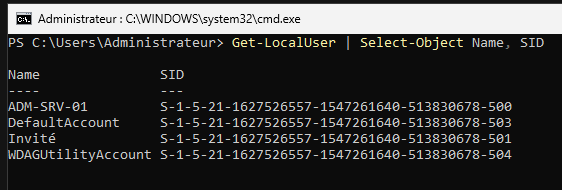

# AD1 Core


!!! abstract "Informations sur le document"
    - **Auteur :** KADA Amine
    - **Classe :** BTS SIO 2 - Option SISR
    - **Date :** 09/09/2026
    - **Sujet :** AD1 Core

---

## Contexte
Ce document détaille la procédure d'initialisation et de sécurisation (Hardening) du serveur Windows Server 2025 (édition Core) nommé AD1 Core. Il couvre la synchronisation temporelle indispensable à Active Directory, la configuration du pare-feu, la gestion des mises à jour centralisées via PowerShell, la sécurisation du compte administrateur local, ainsi que l'intégration des pilotes VirtIO/QEMU nécessaires au fonctionnement optimal sur l'hyperviseur.

## Déploiement des utilitaires de virtualisation

### Exécution des agents VirtIO. Lancement de l'installateur des pilotes paravirtualisés depuis le support monté.
```powershell
Start-Process -FilePath "D:\virtio-win-guest-tools.exe"
```
Puis mettre dans le FilePath : "D:\virtio-win-guest-tools.exe"

- Start-Process : Exécute le binaire d'installation de l'agent invité QEMU.





### Configuration du service QEMU-GA. Définition du lancement automatique pour assurer la communication hyperviseur/machine virtuelle.
```powershell
Set-Service -Name "QEMU-GA" -StartupType Automatic
Start-Service QEMU-GA
```

- -StartupType Automatic : Garantit la disponibilité du service QEMU Guest Agent dès le démarrage de Windows Server.



## Configuration réseau statique

### Identification de l'interface réseau
Il faut d'abord repérer le numéro d'index (`ifIndex`) de la carte réseau virtuelle pour lui appliquer les paramètres.
```powershell
Get-NetAdapter
```
- Repérez la valeur dans la colonne `ifIndex` correspondant à votre carte réseau (généralement nommée Ethernet).

### Attribution de l'adresse IP, du Masque et de la Passerelle
Utilisez l'index récupéré pour définir les paramètres IP statiques. *(Exemple avec l'index `3`, l'IP `192.168.4.10`, masque `/25` et la passerelle `192.168.4.126`)*.

```powershell
New-NetIPAddress -InterfaceIndex 3 -IPAddress "192.168.4.10" -PrefixLength 25 -DefaultGateway "192.168.4.126"
```
- `-InterfaceIndex` : L'index de la carte réseau (ici `3`).
- `-IPAddress` : L'adresse IP statique du serveur AD.
- `-PrefixLength` : La longueur du masque de sous-réseau en notation CIDR (ex: `25` pour `255.255.255.128`).
- `-DefaultGateway` : L'adresse IP de la passerelle par défaut.

### Configuration des serveurs DNS
Définition des serveurs DNS. Pour un serveur AD, on renseigne généralement lui-même en boucle locale (`127.0.0.1`) et/ou le DNS récursif de l'agence en secondaire.

```powershell
Set-DnsClientServerAddress -InterfaceIndex 3 -ServerAddresses ("127.0.0.1")
```
- `-ServerAddresses` : Liste des adresses IP des serveurs DNS séparées par une virgule.

## Configuration NTP

### Configuration des pools de serveurs. Établissement de la synchronisation manuelle sur les serveurs de temps publics pour garantir l'intégrité de l'horloge système.

```powershell title="Configuration W32Time"
w32tm /config /manualpeerlist:"0.fr.pool.ntp.org 1.fr.pool.ntp.org" /syncfromflags:manual /reliable:yes /update
Restart-Service W32Time
w32tm /resync
```
- /manualpeerlist : Spécifie les adresses des pairs NTP externes.
- /reliable:yes : Indique que cet ordinateur est une source de temps fiable (nécessaire pour un futur contrôleur de domaine).



### Validation des homologues NTP. Contrôle de l'état du service de temps local.
```powershell
w32tm /query /peers
w32tm /query /status
```
- /peers : Affiche l'état des connexions avec les serveurs de temps configurés.
- /status : Renvoie les détails sur la latence, la précision et la dernière synchronisation effectuée.



## Paramétrage Sécurité et Pare-feu

### Vérification UAC et Profils Pare-feu. Audit des politiques de pare-feu globales (Domaine, Privé, Public).
```powershell
Get-NetFirewallProfile | Select-Object Name, Enabled

```



## Mise à jour du système

### Téléchargement et installation des KBs. Utilisation de l'API Windows Update pour mettre le système en conformité via le module PSWindowsUpdate.
```powershell
Get-Service -Name wuauserv
Start-Service -Name wuauserv
UsoClient StartScan

Install-PackageProvider -Name NuGet -MinimumVersion 2.8.5.201 -Force
Install-Module PSWindowsUpdate -Force
Install-WindowsUpdate -AcceptAll -Install
Restart-Computer
```

- UsoClient StartScan : Force le lancement asynchrone de la recherche de mises à jour.
- -AcceptAll -Install : Approuve et installe automatiquement tous les correctifs approuvés sans interaction manuelle.



!!! warning "Action requise"
    Un redémarrage du système (Restart-Computer) est strictement requis après la passe d'installation des correctifs cumulatifs.

## Sécurisation du compte local Administrateur

### Renommage et changement de mot de passe. Modification du nom d'utilisateur associé au SID 500 pour compliquer les attaques par énumération, et renouvellement du mot de passe avec une entrée sécurisée.
```powershell
Get-LocalUser -Name "Administrateur" | Select-Object Name, SID, Enabled
Rename-LocalUser -Name "Administrateur" -NewName "ADM-SRV-01"
Get-LocalUser -Name "ADM-SRV-01" | Select-Object Name, SID, Enabled
Set-LocalUser -Name "ADM-SRV-01" -Password (Read-Host "Nouveau mot de passe" -AsSecureString)
```
- Rename-LocalUser : Modifie le SAMAccountName local.
- -AsSecureString : Chiffre la saisie du mot de passe stocké en mémoire vive pendant la transaction.


