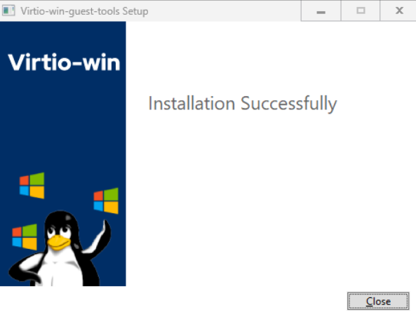

# BLOC 2 - Configuration Windows Core


<div style="margin-top: 70px; border: 1px solid #ccc; padding: 20px; border-radius: 10px;">
    <p><strong>Auteur :</strong> KADA Amine</p>
    <p><strong>Classe :</strong> BTS SIO 2 - Option SISR</p>
    <p><strong>Date :</strong> 09/09/2026</p>
    <p><strong>Contexte :</strong> Configuration Configuration Windows Core</p>
</div>

---

## Informations

* **Auteur :** Amine Kada
* **Date :** 09/09/2026
* **Domaine :** Administration Windows

---

## 2. Contexte

Ce document détaille la procédure de configuration post-déploiement d'un serveur Windows Core 2025 dans un environnement virtualisé. La configuration inclut l'installation des pilotes VirtIO (QEMU), le paramétrage réseau statique, la jonction DNS, ainsi que le durcissement du système (Hardening) selon les recommandations de l'ANSSI. Ces étapes garantissent que le serveur s'intègre correctement à l'infrastructure, communique sur le réseau de manière sécurisée, et prévient les vulnérabilités de configuration par défaut.

## 3. Préparation et Installation des Pilotes

3.1. **Vérification de la configuration IP initiale.** Constat de l'absence de configuration réseau due au manque de pilotes.

```powershell
Configuration IP de Windows

```

3.2. **Identifier le volume des pilotes.** Recherche du lecteur contenant les outils invités (Guest Tools).

```powershell
Get-Volume

```

* `Get-Volume` : Commande sans argument listant les volumes de stockage disponibles (lettres de lecteur).

3.3. **Accéder au volume et lister son contenu.** Navigation dans le lecteur D.

```powershell
ls D:

```

* `D:` : Argument spécifiant la lettre du lecteur à cibler pour lister les fichiers.

3.4. **Lancer l'installation des outils QEMU.** Installation des pilotes VirtIO en 64 bits.

```powershell
Start-Process -FilePath "D:\virtio-win-guest-tools.exe"

```

* `-FilePath` : Spécifie le chemin d'accès absolu vers l'exécutable à lancer.



3.5. **Configurer le démarrage automatique de QEMU Guest Agent.**

```powershell
Set-Service -Name "QEMU-GA" -StartupType Automatic

```

* `-Name` : Définit le nom système du service ciblé.
* `-StartupType` : Définit le mode de démarrage du service (ici, `Automatic` pour un lancement au boot).

3.6. **Démarrer le service QEMU-GA.**

```powershell
Start-Service QEMU-GA

```

* `QEMU-GA` : Paramètre positionnel désignant le nom du service à démarrer.

3.7. **Vérifier l'état du service.** S'assurer que le statut est bien `Running`.

```powershell
Get-Service -Name "QEMU-GA"

```

* `-Name` : Spécifie le nom du service dont on souhaite récupérer l'état.

## 4. Configuration Réseau IP et DNS

4.1. **Vérification de la détection de la carte réseau.** Validation de l'installation des pilotes VirtIO.

```powershell
Get-NetAdapter

```

* `Get-NetAdapter` : Commande sans argument affichant les interfaces réseau physiques ou virtuelles reconnues par le système.

4.2. **Configuration de l'adresse IP statique.** Attribution de l'adressage au serveur.

```powershell
New-NetIpAddress -InterfaceAlias "Ethernet" -IPAddress "192.168.4.1" -PrefixLength 25 -DefaultGateway "192.168.4.126"

```

* `-InterfaceAlias` : Cible l'interface réseau par son nom (ex: "Ethernet").
* `-IPAddress` : Définit l'adresse IPv4 statique assignée à l'interface.
* `-PrefixLength` : Définit le masque de sous-réseau en notation CIDR (25 = 255.255.255.128).
* `-DefaultGateway` : Spécifie l'adresse de la passerelle par défaut.

4.3. **Configuration des serveurs DNS.** Définition des résolveurs DNS.

```powershell
Set-DnsClientServerAddress -InterfaceAlias "Ethernet" -ServerAddresses ("9.9.9.9", "8.8.8.8", "1.1.1.1")

```

* `-InterfaceAlias` : Identifie la carte réseau sur laquelle appliquer la configuration DNS.
* `-ServerAddresses` : Accepte un tableau contenant les adresses IP des serveurs DNS primaire et secondaires.

4.4. **Vérification globale de la configuration réseau.** Validation des paramètres appliqués.

```cmd
ipconfig /all

```

* `/all` : Argument ordonnant l'affichage détaillé de l'ensemble des configurations TCP/IP pour chaque carte.

## 5. Configuration Système

5.1. **Renommer le serveur.** Changement du nom d'hôte pour correspondre à la nomenclature.

```powershell
Rename-Computer -NewName "ServeurAD0" -Restart

```

* `-NewName` : Indique le nouveau nom d'hôte de la machine.
* `-Restart` : Force le redémarrage immédiat de l'OS pour appliquer le nouveau nom.

## 6. Sécurisation (Recommandations ANSSI)

6.1. **Configuration de la synchronisation temporelle (NTP).** Utilisation du pool NTP français.

```cmd
w32tm /config /manualpeerlist:"0.fr.pool.ntp.org,0x1 1.fr.pool.ntp.org,0x1" /syncfromflags:manual /update; Restart-Service w32time

```

* `/config` : Indique la volonté de modifier la configuration du service de temps Windows.
* `/manualpeerlist:` : Liste les serveurs NTP externes. Le paramètre `0x1` définit l'intervalle d'interrogation.
* `/syncfromflags:manual` : Oblige le système à utiliser la liste des serveurs définie manuellement.
* `/update` : Applique les nouveaux paramètres à l'instance en cours d'exécution.
* `Restart-Service` : Commande PowerShell redémarrant le service `w32time`.

6.2. **Vérification de l'activation de l'UAC.** L'UAC (User Account Control) doit être activé (valeur à 1).

```powershell
(Get-ItemProperty HKLM:\Software\Microsoft\Windows\CurrentVersion\Policies\System).EnableLUA

```

* `Get-ItemProperty` : Lit les propriétés de la clé de registre pointant sur la configuration de l'UAC.
* `.EnableLUA` : Isole la valeur exacte de la stratégie LUA (1 = Activé, 0 = Désactivé).

6.3. **Vérification de l'activation du pare-feu.** S'assurer que les trois profils Defender sont actifs.

```powershell
Get-NetFirewallProfile | Select-Object Name, Enabled

```

* `|` (Pipe) : Transmet la sortie de la première commande en entrée de la seconde.
* `Select-Object` : Filtre les résultats.
* `Name, Enabled` : Propriétés sélectionnées pour l'affichage (Nom du profil et son état).

6.4. **Installation du module de gestion des mises à jour.**

```powershell
Install-Module PSWindowsUpdate

```

* `PSWindowsUpdate` : Nom explicite du module PowerShell à télécharger depuis la PSGallery.

6.5. **Recherche des mises à jour Windows.**

```powershell
Get-WindowsUpdate

```

* `Get-WindowsUpdate` : Commande interrogeant l'API de Windows Update pour lister les correctifs manquants.

6.6. **Installation des mises à jour système.** Application des correctifs de sécurité.

```powershell
Install-WindowsUpdate -AcceptAll -AutoReboot

```

* `-AcceptAll` : Accepte automatiquement tous les contrats de licence (EULA) des correctifs.
* `-AutoReboot` : Autorise le serveur à redémarrer de lui-même si une mise à jour l'exige.

6.7. **Lister les comptes locaux et leurs SID.** Repérage du compte Administrateur par défaut (SID finissant par 500).

```powershell
Get-LocalUser | Select-Object Name, SID

```

* `Name, SID` : Affiche uniquement les colonnes du nom d'utilisateur et de son identifiant de sécurité unique (SID).

6.8. **Renommer le compte Administrateur intégré.** Obfuscation du compte à privilèges (recommandation ANSSI).

```powershell
Rename-LocalUser -Name "Administrateur" -NewName "ADM-SRV-00"

```

* `-Name` : Cible le nom actuel du compte local.
* `-NewName` : Définit le nouveau nom du compte utilisateur.

6.9. **Modification du mot de passe Administrateur.** Application d'un mot de passe robuste stocké dans un gestionnaire (Bitwarden).

```powershell
Set-LocalUser -Name "ADM-SRV-00" -Password (ConvertTo-SecureString "MotDePasseBitwardenIci" -AsPlainText -Force)

```

* `-Name` : Cible l'utilisateur local dont on souhaite changer le mot de passe.
* `-Password` : Paramètre attendant un objet de type `SecureString` en entrée.
* `-AsPlainText` : Indique à `ConvertTo-SecureString` que la chaîne fournie est en texte clair.
* `-Force` : Oblige PowerShell à convertir la chaîne en clair vers un format sécurisé malgré l'avertissement de sécurité standard.